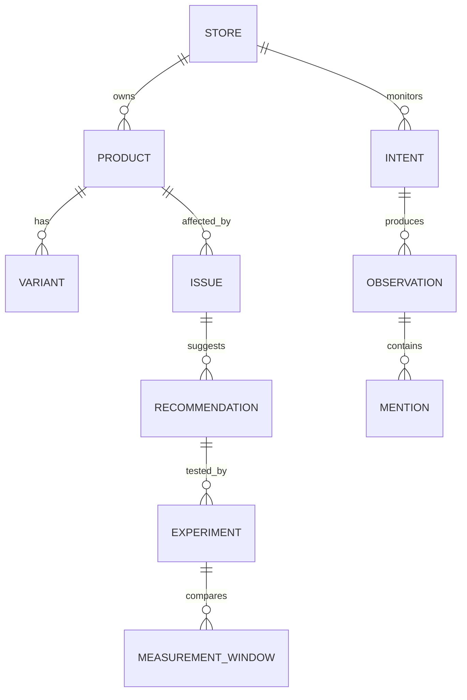
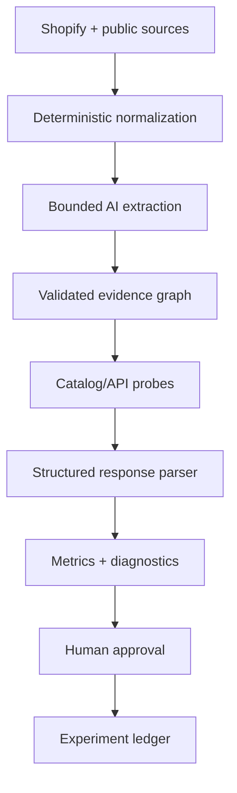
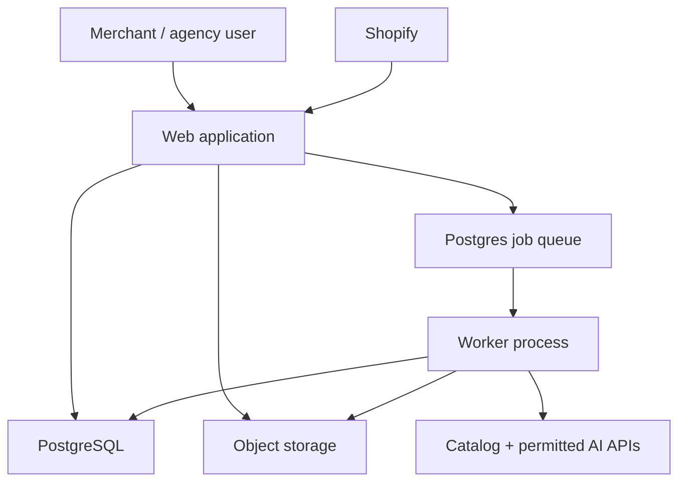

# AgentRank

## Production Product Specification

**Version:** 1.0  
**Status:** Build-ready MVP specification  
**Research cut-off:** 28 August 2026  
**Primary audience:** Founder, product designer, AI coding agent, application engineer, data/AI engineer, growth lead  
**Initial platform:** Shopify  
**Category:** AI commerce observability and experimentation

> **Naming warning:** “AgentRank” is a working codename only. Multiple active Shopify App Store listings already use AgentRank for AI-commerce visibility/optimization, and an AGENTRANK U.S. trademark application exists in adjacent AI/software services. Do not create a public brand, domain, app listing, or legal entity under this name without professional clearance and a broader naming search.

---

## 0. Document purpose and decision summary

This document is the primary product and engineering blueprint for building AgentRank. It refines the original concept rather than merely expanding it.

### 0.1 Strategic verdict

AgentRank is viable only if it is narrower and more rigorous than a generic “AI visibility tracker.” That market is already crowded, and several parts of the original concept are being commoditized:

- Shopify now gives merchants agentic-channel performance reporting, query insights, catalog search previews, and product-data recommendations.
- Google Merchant Center is piloting first-party AI share-of-voice, journey-stage, product-term, and attribute-completeness insights.
- Scrunch offers product-level AI shopping visibility and share-of-shelf reporting.
- Semrush, Ahrefs, Otterly, Peec, AthenaHQ, Profound, Evertune, and others already monitor brand mentions, citations, prompts, and competitors.
- Adobe Brand Visibility combines Semrush-scale demand data with diagnosis, deployment, and business-impact measurement for enterprise customers.

AgentRank therefore must not compete on “we ask chatbots whether they mention your brand.” Its initial wedge is:

> **Independent, product-level observability and evidence-graded experimentation for Shopify brands and agencies.**

Its differentiated loop is:

> **Normalize the catalog → test controlled buyer intents → grade the evidence → identify product-level gaps → track approved changes → measure directional lift and revenue signals.**

### 0.2 Non-negotiable product decisions

1. **Measurement before automation.** MVP recommends changes but never writes to the merchant's store.
2. **No consumer-interface scraping.** Automated consumer ChatGPT, Gemini, Claude, Perplexity, or Grok sessions are out of scope unless a provider supplies explicit commercial authorization.
3. **Every observation carries a signal class.** Native first-party data, official catalog retrieval, provider API probes, and deterministic audits must never be presented as equivalent.
4. **No universal deterministic rank.** Results are samples with dates, locations, model/provider identifiers, repetitions, and uncertainty.
5. **No invented product claims.** Product facts require field-level provenance from merchant-controlled or public evidence.
6. **No causal claims from simple before/after changes.** The system uses “confirmed,” “supported hypothesis,” “directional lift,” and “inconclusive” precisely.
7. **Modular monolith for MVP.** One TypeScript codebase, one PostgreSQL database, one worker process, and managed object storage. No microservices.
8. **Shopify-first, not Shopify-dependent forever.** Commerce adapters isolate Shopify-specific ingestion and publishing logic.
9. **The sellable unit is a decision, not a score.** Users pay to know what to fix, why it matters, and whether the intervention appears to work.
10. **Rename before launch.** Product architecture may retain `agentrank` as a temporary internal codename, but all public-facing naming requires a new brand and trademark/domain clearance.

### 0.3 MVP definition in one sentence

A Shopify merchant installs AgentRank, receives a normalized product and catalog-readiness audit, selects a controlled set of buyer intents, observes official catalog and permitted provider-API results, sees evidence-backed product-level issues, and tracks approved recommendations as experiments.

### 0.4 Success threshold for continuing the company

Before building V1, the founder should require all of the following:

- 10 design-partner stores complete an audit.
- At least 5 users return to review a second measurement cycle.
- At least 3 stores pay at least $79/month or sign a paid pilot.
- At least 30% of high-priority recommendations are accepted or exported.
- At least 2 customers can point to a decision they changed because of AgentRank.
- Blended provider and infrastructure cost stays below 20% of recognized subscription revenue.

If these thresholds are not reached after 12 weeks of active design-partner use, do not proceed to automated publishing.

---

# Part I — Product and market

## 1. Executive summary

Shopping discovery is moving from lists of links toward conversational systems that identify, compare, and increasingly transact with products. For a merchant, this creates a new set of operational questions: Is the catalog readable? Which products are retrieved for which needs? Which competitors occupy the recommendation set? Are important facts absent or contradicted? Which merchant-controlled intervention deserves attention? Did the intervention improve discovery or business outcomes?

Traditional SEO tools are not designed around product variants, live availability, catalog protocols, model sampling, or intervention measurement. First-party platforms provide useful but channel-specific analytics. General GEO products often operate at brand or page level rather than at the product/variant and commercial-outcome level.

AgentRank fills the gap between first-party channel dashboards and broad GEO suites. It creates a canonical commerce evidence layer across:

- merchant product data;
- public product pages and structured data;
- official catalog retrieval surfaces;
- permitted provider API probes;
- competitors and cited sources;
- catalog/content changes;
- referral and revenue data when connected.

The MVP targets Shopify brands with 20–2,000 active products and agencies serving them. It begins read-only. The primary output is not a generic score; it is a prioritized, auditable backlog of product-level actions tied to a reproducible baseline.

### 1.1 Product promise

> **See how commerce agents can understand and retrieve your products, learn why competitors win relevant intents, and test whether your changes improve the evidence.**

### 1.2 What AgentRank is

- An independent commerce discovery observability layer.
- A normalized product and intent graph.
- A repeatable test harness for official catalogs and permitted AI APIs.
- An evidence system for catalog/content gaps.
- An experiment ledger connecting changes to discovery and outcome signals.

### 1.3 What AgentRank is not

- A guarantee of placement in ChatGPT, Gemini, or another consumer product.
- An automated chatbot scraper.
- A generic AI copywriter.
- An `llms.txt` generator presented as a ranking solution.
- A schema-only optimizer.
- A replacement for Shopify Catalog, Google Merchant Center, or analytics.
- A system that fabricates benefits, comparisons, reviews, or medical claims.

## 2. Problem definition

### 2.1 User problem

Merchants have fragmented evidence and cannot reliably connect it into decisions:

- Shopify may show how Shopify Catalog or agentic storefronts perform, but not an independent cross-provider view.
- Google can report Google-owned AI impressions, but not other ecosystems.
- Provider APIs and consumer surfaces behave differently.
- AI responses vary across time, locale, session context, personalization, and model updates.
- Product information is distributed across Shopify fields, metafields, pages, JSON-LD, feeds, reviews, policies, and third-party sources.
- A mention does not necessarily represent accurate product understanding, a merchant link, an eligible offer, or a conversion.
- A change followed by a higher score is not proof that the change caused the improvement.

### 2.2 Root causes

1. **Catalog heterogeneity:** categories use different attribute sets; generic completeness scores reward irrelevant fields.
2. **Surface fragmentation:** each catalog, model, search provider, and channel has different retrieval and ranking logic.
3. **Observability gaps:** providers expose partial or no impression-level data.
4. **Nondeterminism:** repeated responses can produce different candidate sets and ordering.
5. **Identity resolution:** the same product may be represented by a brand, model family, variant, seller, marketplace listing, or canonical GTIN.
6. **Attribution loss:** some AI referrals omit useful referrer or intent detail; direct checkout may happen off-site.
7. **Weak experimentation:** content, price, inventory, competitors, demand, and model versions change simultaneously.
8. **Incentive misalignment:** optimization tools are tempted to turn correlations into confident claims.

### 2.3 Product opportunity

The opportunity is not to reverse-engineer a secret “AI ranking algorithm.” It is to make fragmented commerce evidence operational:

- deterministic where the system can be deterministic;
- probabilistic where the system samples models;
- transparent about missing data;
- actionable at product and intent level;
- longitudinal across interventions.

## 3. Market analysis

### 3.1 Why the market exists

AI-referred retail traffic is still smaller than traditional search, but it is growing quickly and is increasingly high-intent. [Adobe reported](https://business.adobe.com/resources/sdk/2026-q2-ai-traffic-report.html) that AI traffic to U.S. retail sites grew 393% year over year in Q1 2026; its March 2026 data showed AI-referred retail traffic converting 42% better than non-AI traffic. [Shopify reported](https://www.shopify.com/blog/how-agentic-commerce-works) that, in Q1 2026, AI-driven traffic to Shopify stores grew eightfold year over year and orders from AI-powered searches increased nearly thirteenfold. These figures should be treated as directional vendor research, not a universal forecast.

At the same time, the value of a generic visibility dashboard is falling. Shopify and Google are adding first-party measurements, while large marketing suites are bundling GEO into existing subscriptions. AgentRank must therefore monetize workflow, independence, product-level specificity, and experimental rigor rather than basic monitoring.

### 3.2 Bottom-up serviceable market

Do not anchor the company on a speculative multibillion-dollar TAM. Use a bottom-up serviceable market:

- Initial reachable segment: Shopify brands with 20–2,000 products, meaningful English-language DTC sales, and an existing SEO/ecommerce-tool budget.
- Initial buyers: ecommerce manager, growth/SEO lead, founder, and ecommerce agency.
- Plausible average revenue per account during the first two years: $100–$300/month for brands and $500–$1,000/month for agencies.
- A sustainable early business at 500 brand-equivalent accounts and $180 blended monthly ARPA would be approximately $1.08M ARR.
- The immediate objective is 25 paying accounts, not market domination.

### 3.3 Timing

The timing is favorable for learning but dangerous for undifferentiated products:

- Standards are forming: Shopify/Google's Universal Commerce Protocol (UCP), OpenAI/Stripe's Agentic Commerce Protocol (ACP), product feeds, catalog APIs, and agent storefronts.
- Merchant concern is increasing as product discovery becomes conversational.
- Provider and platform changes can invalidate product assumptions within months.
- First-party products have distribution, proprietary impressions, and direct catalog access that a startup cannot reproduce.

The company should treat 2026–2027 as a rapid validation window.

## 4. Competitive landscape

### 4.1 Competitor groups

| Group | Examples | Strength | AgentRank response |
|---|---|---|---|
| First-party commerce platforms | Shopify Agentic Storefronts, Google Merchant Center AI performance insights | Actual catalog/channel data, distribution, zero incremental setup | Aggregate and compare; never claim to replace; focus on cross-channel experiments |
| Enterprise closed-loop suites | Adobe Brand Visibility, Scrunch, Evertune, AthenaHQ | Broad platform coverage, content workflows, enterprise data and services | Win on Shopify-native product granularity, simplicity, lower cost, experiment ledger |
| AI visibility trackers | Profound, Peec AI, Otterly.AI, Ahrefs Brand Radar, Semrush AI Visibility | Prompt monitoring, large query databases, brand/citation analytics | Focus on products/variants, catalog protocols, evidence classes, interventions |
| Ecommerce optimizers | Shopify SEO/AEO apps, feed optimizers, schema tools | One-click catalog/content fixes and low price | Remain read-only in MVP; prove which change deserves implementation |
| Analytics platforms | Similarweb Gen AI Intelligence, GA4, Adobe Analytics | Referral/traffic data and business outcomes | Connect visibility hypotheses to product-level changes and outcomes |
| Protocol/catalog infrastructure | Shopify Catalog/UCP, OpenAI ACP/product feeds, Merchant Center | Defines eligibility and transactional interoperability | Audit compatibility and data quality; do not build a redundant checkout protocol |

### 4.2 Key named competitors

#### Shopify Agentic Storefronts

By mid-2026 [Shopify merchants could](https://help.shopify.com/en/manual/online-sales-channels/agentic-storefronts/agentic-home) manage AI channels, view sessions, sales, orders, conversion, inspect queries, preview catalog ranking, and receive product-data recommendations. [Shopify Catalog](https://help.shopify.com/en/manual/shopify-catalog) structures and syndicates eligible product data. This is the greatest platform risk to AgentRank's original wedge.

**Implication:** Shopify readiness cannot be the whole paid product. AgentRank must add independent cross-surface testing, competitor evidence, experiment history, and richer diagnosis.

#### Google Merchant Center AI performance insights

[Google's Merchant Center pilot](https://support.google.com/merchants/answer/17200695?hl=en) provides first-party share of voice, journey-stage performance, popular terms, popular attributes, and attribute completeness for Google AI surfaces.

**Implication:** Do not attempt to sell an inferior estimate of Google impressions where the first party can supply actual data. Ingest the merchant's authorized export/API data when available and make it part of a cross-channel experiment.

#### Scrunch

[Scrunch](https://www.scrunch.com/) combines multi-LLM monitoring, citations, agent traffic, site diagnostics, agent-optimized delivery, and product-level Shopping views such as share of shelf and first-position win rate.

**Implication:** AgentRank needs a sharper Shopify and experimentation focus. “Product-level AI monitoring” alone is not unique.

#### Adobe Brand Visibility / Semrush

[Adobe Brand Visibility](https://news.adobe.com/news/2026/06/introducing-adobe-brand-visibility) combines a very large prompt and SEO corpus, owned-channel data, recommendations, optimization deployment, and revenue measurement. It targets enterprise workflows.

**Implication:** AgentRank cannot win by promising the same product at smaller scale. It can win with a purpose-built, self-serve workflow for Shopify teams and agencies.

#### Ahrefs Brand Radar and Semrush AI Visibility

These products bundle AI visibility with established keyword, backlink, and SEO data. As of the research cut-off, [Semrush offered](https://www.semrush.com/pricing/ai/) a $99/month per-domain AI Visibility plan with 25 tracked prompts, while [Ahrefs described](https://help.ahrefs.com/en/articles/11064852-what-is-brand-radar-and-how-to-use-it) hundreds of millions of search-backed prompts.

**Implication:** AgentRank should not claim a superior query corpus at launch. Synthetic prompts must be labeled synthetic.

#### Otterly.AI and Peec AI

These products offer accessible prompt tracking, multi-engine coverage, reports, competitor analysis, and agency workflows. Otterly begins at a low price and meters prompts; Peec similarly meters prompts/models/projects.

**Implication:** Pricing and UX expectations are established. AgentRank needs visible value beyond checking prompts.

#### Direct same-name Shopify apps

As of August 2026, several Shopify App Store listings use “AgentRank” for substantially overlapping products: [AI visibility audits and prompt tests](https://apps.shopify.com/agentrank-1), [product/catalog diagnostics and approved fixes](https://apps.shopify.com/agentrank-2), and [multi-assistant ranking tests and one-click changes](https://apps.shopify.com/agentrank-4). At least one separate AgentRank property also targets Shopify AI readiness, and the name is used by an unrelated AI-agent ranking product.

**Implication:** this is both a naming blocker and unusually direct evidence that the original feature set is commoditized. Rename before public launch and do not rely on exact-name App Store discoverability.

### 4.3 Competitive differentiation

AgentRank's defendable combination is:

1. **Product/variant identity graph:** resolve brand, product family, SKU, variant, GTIN, seller, and URL rather than counting brand strings.
2. **Signal-class honesty:** visibly separate native data, official catalog retrieval, provider API probes, audits, and inferred hypotheses.
3. **Category-aware readiness:** score the attributes that matter for the product category and buyer intent.
4. **Intervention ledger:** version every recommendation, approval, implementation date, affected products, changed fields, and expected mechanism.
5. **Experiment design:** compare matched prompt/product controls, provider versions, and pre/post windows.
6. **Commerce outcomes:** connect changes to AI referrals, product landings, conversion, and revenue without claiming unavailable user-level attribution.
7. **Agency evidence packs:** create repeatable, auditable client deliverables rather than vanity-score screenshots.

### 4.4 Positioning

**Category statement**

> AgentRank is the measurement and experimentation layer for AI-mediated commerce.

**Primary landing-page statement**

> See which buyer needs surface your products, why competitors win, and whether your catalog changes improve discovery.

**Do not use as primary positioning**

- “Rank #1 in ChatGPT.”
- “Guarantee AI recommendations.”
- “SEO for ChatGPT.”
- “One-click AI optimization.”
- “The only product-level AI visibility platform.”

## 5. Ideal customer profile and personas

### 5.1 Initial ICP

#### Brand account

- Shopify store.
- 20–2,000 active products; support up to 5,000 after performance validation.
- Approximately $1M–$50M annual ecommerce revenue.
- English-language storefront; United States, Canada, United Kingdom, Australia, or another explicitly supported market.
- Has an ecommerce/growth owner and an existing budget for SEO, feed management, analytics, or Shopify apps.
- Uses product attributes and comparison-oriented merchandising.
- Sells non-regulated physical goods.

#### Agency account

- Manages 5–30 Shopify clients.
- Already sells SEO, feed management, ecommerce optimization, or analytics.
- Needs evidence, repeatable processes, exports, and multi-store management.
- Can serve as a distribution channel and source of intervention outcomes.

### 5.2 Best initial categories

- footwear and apparel where fit, material, size, use case, and style matter;
- home goods and furniture where dimensions, material, compatibility, room/use case, and delivery matter;
- consumer accessories where compatibility and technical specifications matter;
- fitness equipment and non-medical wellness products;
- specialty hobby, outdoor, and gift products.

### 5.3 Excluded initial categories

- prescription medicine and regulated health products;
- supplements with medical or performance claims;
- firearms, weapons, explosives, controlled substances, alcohol, nicotine, and gambling;
- financial products and insurance;
- adult sexual products;
- products whose primary recommendation requires diagnosing health conditions;
- marketplaces dominated by duplicate seller listings unless product identity can be resolved reliably.

### 5.4 Personas

#### Ecommerce Growth Lead — primary daily user

**Goals:** identify discovery gaps, prioritize catalog work, explain results to leadership, connect improvements to revenue.  
**Pain:** too many dashboards; little causal confidence; limited developer time.  
**Success:** a short weekly backlog with evidence and measurable follow-up.

#### Founder/GM — economic buyer in smaller brands

**Goals:** know whether AI discovery matters, avoid missing a channel shift, spend efficiently.  
**Pain:** does not want another complex SEO suite.  
**Success:** a clear baseline, top three actions, and business-impact trend.

#### SEO/GEO or Ecommerce Agency Strategist — primary agency user

**Goals:** win clients, produce defensible recommendations, standardize reporting, prove renewal value.  
**Pain:** manual prompt checking and fragile spreadsheets.  
**Success:** multi-store dashboards, branded evidence packs, reusable playbooks.

#### Catalog/Merchandising Manager — implementation owner

**Goals:** maintain accurate product information and prioritize missing attributes.  
**Pain:** generic content recommendations ignore product operations.  
**Success:** exact affected SKUs/fields, source evidence, exportable change set.

#### Analyst — secondary user

**Goals:** inspect methodology, export observations, evaluate experiments.  
**Pain:** opaque scores and no raw data.  
**Success:** reproducible data exports and clear confidence/coverage.

## 6. Jobs to be done

### 6.1 Functional jobs

1. When AI shopping becomes material, help me establish a trustworthy baseline without manually checking many assistants.
2. When a competitor repeatedly appears, show me which products, attributes, sources, and intents are associated with the gap.
3. When my catalog has thousands of fields, tell me which missing data matters for which buyer need.
4. When I make a change, preserve the baseline and test whether the result moved beyond normal variation.
5. When leadership asks about AI commerce, connect visibility evidence to referral and revenue signals.
6. When I manage clients, generate consistent and auditable reports efficiently.

### 6.2 Emotional and social jobs

- Reduce fear of missing a structural channel shift.
- Give the practitioner confidence that recommendations are defensible.
- Help agencies appear rigorous rather than opportunistic.
- Let teams show progress even when revenue attribution is incomplete.

## 7. Product principles

1. **Evidence before confidence.** Show the observation and source before the conclusion.
2. **Products before pages.** Resolve findings to products, variants, offers, and intents.
3. **Direction before automation.** The system should be useful before it can write to a store.
4. **Comparability over spectacle.** Standardized probes and stable panels matter more than impressive one-off answers.
5. **Uncertainty is a feature.** Confidence intervals and “insufficient evidence” improve trust.
6. **No fake demand.** Synthetic prompts are suggestions, not observed search volume.
7. **Merchant control.** Competitors, intents, recommendations, and future writes require approval.
8. **Category context.** “Complete” means fit for a buyer decision, not filled with every possible field.
9. **Reversible evolution.** When publishing arrives, every change needs preview, approval, audit, and rollback.

---

# Part II — Scope and experience

## 8. Scope by product stage

### 8.1 Concierge validation — before coded MVP

Run 10–15 audits manually using scripts and structured templates. Validate:

- whether merchants understand signal classes;
- whether product-level gaps are surprising and actionable;
- which categories produce reliable entity/product matching;
- willingness to pay;
- whether users implement recommendations;
- baseline cost per probe and per audit.

Do not automate low-value screens before this validation.

### 8.2 MVP — must exist

#### Accounts and onboarding

- Public free audit entry by store URL.
- Shopify embedded app installation for persistent paid use.
- One organization, one Shopify store, multiple invited users only on paid plans.
- Store category and target-market confirmation.
- Explicit consent to crawl public pages and process catalog data.

#### Ingestion and normalization

- Shopify GraphQL Admin API read-only product ingestion.
- Public crawl of homepage, selected collections, products, policies, and FAQs.
- JSON-LD/schema extraction and validation.
- Normalized product, variant, offer, attribute, policy, and source records.
- Field-level provenance and confidence.
- Incremental synchronization through product webhooks and scheduled reconciliation.

#### Intent panel

- Generate category-aware synthetic buyer intents.
- Cluster and deduplicate intents.
- Merchant reviews, edits, deletes, pins, and weights the panel.
- Tag every intent by source: synthetic, merchant-entered, first-party observed, or imported.
- Support one language and one locale per workspace in MVP.

#### Measurement

- Official Shopify Global/Storefront Catalog retrieval adapter where available.
- At least two permitted provider API probe adapters at launch.
- Scheduled probe execution with exact request metadata.
- Three staggered repetitions for baseline priority intents; single repetition for exploratory intents.
- Raw response retention, normalized brand/product mentions, ranks, links, citations, and sentiment/fit labels.
- User-approved competitor identity map.

#### Audit and diagnosis

- Category-aware Catalog Readiness Score.
- Product-level Agent Readiness Score.
- Intent inclusion, recommendation share, rank credit, citation/merchant-link share, and confidence.
- Deterministic technical issues.
- Evidence-backed comparative hypotheses.
- Prioritized issue backlog with affected products, evidence, difficulty, confidence, risk, and exact proposed change.

#### Experiment ledger

- Convert a recommendation into an experiment.
- Record baseline window, target intents/products, expected mechanism, control set, implementation timestamp, and notes.
- Detect Shopify product-field changes and capture before/after hashes.
- Post-change measurement and directional result classification.
- No automatic publishing.

#### Reporting and billing

- Overview, Intents, Products, Competitors, Issues, Experiments, Methodology, and Settings screens.
- Shareable web report and CSV export; PDF export may be server-rendered from the report.
- Shopify Billing API subscription plans.
- Usage meter in probe units.

### 8.3 Explicitly out of scope for MVP

- Automated changes to Shopify products, themes, pages, feeds, or metafields.
- Consumer UI automation or scraping.
- Claims to reproduce personalized consumer results.
- Full crawling of more than 500 public pages.
- Review-platform ingestion that violates license terms.
- Agency multi-store control plane.
- More than one locale/language per workspace.
- WooCommerce, BigCommerce, Magento, Amazon, or marketplace integrations.
- Direct checkout, cart, payment, order, return, or UCP/ACP transaction implementation.
- User-level attribution between a specific probe and a purchase.
- Keyword-volume claims for synthetic intents.
- Backlink/PR outreach automation.
- AI-generated medical, safety, performance, sustainability, or comparative claims.

### 8.4 V1 — after first paying customers

- GA4 and Google Search Console integrations.
- Import of Shopify agentic performance exports and Google Merchant Center AI performance data where authorized access exists.
- Agency workspace with multiple stores, roles, shared prompt templates, and white-label reports.
- Multi-locale intent panels.
- Draft change-set export to CSV and Shopify-compatible format.
- Category benchmark aggregates with privacy thresholds.
- Alerts for visibility regressions, broken structured data, and provider/model shifts.
- Matched-control experiment recommendations.
- API and webhook access for agencies.

### 8.5 V2 — after product-market evidence

- Merchant-approved publishing to product fields/metafields with least-privilege permission escalation.
- Diff preview, approval workflow, scheduled publish, rollback, and audit log.
- WooCommerce and BigCommerce adapters.
- Feed validation/export for OpenAI product feeds, Google Merchant Center, and other supported channels.
- Source/citation opportunity workflows.
- Product-information-management integrations.
- Advanced causal analysis and category-specific playbooks.

### 8.6 Long-term infrastructure

- Cross-commerce semantic and recommendation graph.
- UCP/ACP conformance and observability suite.
- Privacy-safe intervention benchmark network.
- Real-time product representation monitoring across commerce agents.
- Agent-accessible API/MCP for product teams and agencies.
- Enterprise governance, SSO, SCIM, data residency, and bring-your-own-model/provider accounts.

## 9. User stories

### 9.1 Onboarding and ingestion

- As a merchant, I want to connect my Shopify store so the audit uses authoritative product data.
- As a merchant, I want to see exactly which permissions AgentRank requests and why.
- As a user with a large catalog, I want scan progress and partial results rather than a blank waiting screen.
- As a catalog manager, I want each extracted fact linked to its source field or page.
- As a user, I want to correct an incorrect product/category mapping without changing my store.

### 9.2 Intent and measurement

- As a growth lead, I want suggested buyer intents grounded in my actual catalog.
- As a user, I want synthetic intents visibly labeled so I do not confuse them with real demand.
- As a user, I want to pin high-value intents and reduce spend on irrelevant ones.
- As an analyst, I want each result's provider, model, time, locale, sampling count, and signal class.
- As a user, I want to compare results without being told that one sample is a stable rank.

### 9.3 Diagnosis and action

- As a merchant, I want to know which products are affected by a missing attribute.
- As a catalog manager, I want exact proposed field changes based only on verified facts.
- As a user, I want confirmed technical errors separated from hypotheses.
- As a user, I want to dismiss or snooze irrelevant issues and preserve the reason.
- As an agency strategist, I want evidence I can show a client.

### 9.4 Experiments and reporting

- As a user, I want to freeze a baseline before implementing a recommendation.
- As a user, I want AgentRank to detect that a product changed and ask me to associate the change with an experiment.
- As an analyst, I want a matched control or a warning when none exists.
- As a user, I want results classified as positive, negative, neutral, or inconclusive with supporting data.
- As an executive, I want the business-impact view to distinguish observed referrals from estimated visibility.

## 10. Information architecture

### 10.1 Primary navigation

1. **Overview**
2. **Intents**
3. **Products**
4. **Competitors**
5. **Issues**
6. **Experiments**
7. **Reports**
8. **Methodology**
9. **Settings**

### 10.2 Global controls

- Workspace/store selector; single store in MVP.
- Measurement window.
- Locale.
- Signal-class filter.
- Provider filter.
- Data freshness indicator.
- Run scan/probe action if quota allows.
- Help/methodology shortcut.

### 10.3 Core entity relationships



## 11. Core user flows

### 11.1 Free audit

1. Visitor enters store URL and business email.
2. System validates domain, robots access, platform, category, and public product availability.
3. User confirms ownership/authorization and target market.
4. System crawls a bounded sample: homepage, up to three collections, up to 20 products, policies, and FAQ pages.
5. System validates product structured data and creates a preview category-aware readiness audit.
6. System generates five synthetic intents and runs a tightly limited permitted probe set.
7. Report shows preview readiness, observed inclusion, top competitors, three issues, evidence class, and limitations.
8. CTA asks the user to install Shopify app to audit the full catalog and track changes.

### 11.2 Shopify onboarding

1. Merchant installs embedded app.
2. App requests `read_products` and only other scopes proven necessary; no order/customer scope.
3. User selects target country, language, primary categories, brand aliases, and canonical domain.
4. Initial catalog bulk sync starts.
5. Public site crawl starts in parallel.
6. Normalization and category classification run.
7. User reviews detected product categories, brand aliases, and excluded products.
8. System generates an intent candidate panel.
9. User selects/pins at least 10 and no more than plan allowance.
10. Baseline runs and partial data appear as each stage completes.

### 11.3 Diagnose a lost intent

1. User opens a weak intent from Overview or Intents.
2. Intent detail shows results by signal class/provider, repetitions, products, competitors, sources, and uncertainty.
3. User opens “Why might we be losing?”
4. System shows confirmed issues first, then comparative hypotheses.
5. Each hypothesis exposes evidence: merchant fields, competitor pattern, cited sources, coverage, and counterevidence.
6. User selects a recommendation and sees affected SKUs, proposed fields/content, risk, and effort.
7. User exports it or creates an experiment.

### 11.4 Create and measure an experiment

1. User clicks “Test this recommendation.”
2. System pre-fills hypothesis, target intents/products, metric, recommended baseline, and possible controls.
3. User confirms baseline and marks implementation method: manual Shopify edit, external agency, feed update, or other.
4. System freezes baseline observation IDs and product snapshots.
5. User implements the change outside AgentRank and records/validates completion.
6. Webhook or reconciliation detects changed fields and attaches the version diff.
7. Post-change probes run on the same schedule and panel.
8. Result shows absolute and relative change, control movement, uncertainty, confounders, and classification.
9. User accepts, extends, or closes the experiment.

## 12. Screen-by-screen UX specification

### 12.1 Public audit landing page

**Goal:** convert a qualified merchant without promising deterministic ranks.

**Components:**

- Headline and concise explanation.
- URL and email form.
- Supported-store/category notice.
- “What this measures” signal-class explainer.
- Example evidence card, not a fabricated leaderboard.
- Consent checkbox and privacy link.
- State handling for invalid domain, unsupported/regulated category, blocked crawl, no products, rate limit, and existing audit.

**Acceptance notes:** never use “guaranteed,” “rank #1,” or consumer product logos in a way that implies partnership.

### 12.2 Onboarding wizard

**Steps:** Connect → Catalog → Market → Brand → Intent panel → Baseline.

**Required UI behavior:**

- Persistent progress and safe resume.
- Every skipped input has a default and explanation.
- Category mapping shows confidence and permits correction.
- Intent panel shows source, type, product coverage, and edit control.
- Baseline cost/usage estimate appears before running.

### 12.3 Overview

**Goal:** answer “What changed, what matters, and what should I do?”

**Top row:**

- AgentRank Index, only if minimum coverage is met; otherwise “Building baseline.”
- Recommendation inclusion rate with confidence interval.
- Competitive recommendation share.
- Catalog Readiness.
- AI-attributed sessions/revenue only when observed integration data exists.

**Main modules:**

- Signal coverage and freshness strip.
- Trend by provider/signal class.
- Strongest and weakest intent clusters.
- Product opportunity matrix: commercial priority vs. readiness gap.
- Top competitors gained/lost.
- Prioritized next actions.
- Active experiment status.
- Recent platform/model change warnings.

**Rules:** all trend comparisons require compatible panels; otherwise show a panel-change break marker.

### 12.4 Intents list

**Columns:** intent text, source, type, funnel stage, linked categories/products, business weight, inclusion rate, rank credit, competitor leader, providers, sample count, last run, confidence.

**Filters:** source, type, stage, category, product, provider, signal class, locale, visibility band, confidence, active experiment.

**Actions:** add, edit, archive, pin, set weight, run now, add to experiment, export.

**Intent detail:**

- Definition and metadata.
- Time-series with panel consistency markers.
- Result distribution by provider and repetition.
- Candidate products and ranks.
- Competitor share.
- Citations/merchant links.
- “Why” evidence drawer.
- Related issues and experiments.
- Raw observation access for authorized users.

### 12.5 Products list

**Columns:** product, active variants, category, Agent Readiness, intent coverage, inclusion rate, top gap, offer freshness, last catalog sync.

**Product detail:**

- Canonical product/variant identity.
- Normalized attributes with provenance and confidence.
- Source comparison: Shopify vs. page vs. JSON-LD/feed.
- Conflicts and stale values.
- Category-specific readiness breakdown.
- Intents where product appears or is absent.
- Competitor substitutes.
- Issues, recommendations, and experiments.

### 12.6 Competitors

**List:** approved competitor, discovery source, aliases/domains, overlap categories, recommendation share, winning intents, cited domains, confidence.

**Competitor detail:**

- Share trend.
- Overlapping products/intent clusters.
- Attribute coverage comparison.
- Commonly cited sources.
- Evidence limitations.

**Rule:** auto-detected entities remain “candidate competitors” until approved. Marketplaces and retailers are classified separately from brands.

### 12.7 Issues

**Columns:** priority, title, evidence class, status, affected products, linked intents, expected mechanism, confidence, effort, risk, detected date.

**Tabs:** Confirmed issues, Supported hypotheses, Opportunities, Dismissed.

**Issue detail:**

- Plain-language finding.
- Why it matters.
- Evidence and counterevidence.
- Affected SKUs and fields.
- Exact recommended change with provenance.
- Impact/confidence/effort/risk rationale.
- Export, dismiss, snooze, or create experiment.

### 12.8 Experiments

**List:** hypothesis, status, products/intents, baseline dates, implementation date, result, confidence, confounders.

**Detail:**

- Pre-registered hypothesis and primary metric.
- Treatment/control definitions.
- Frozen baseline and change diff.
- Provider/model/panel stability.
- Pre/post and difference-in-differences views.
- Business outcome overlay.
- Automated caveats.
- Decision: adopt, revert externally, extend, or inconclusive.

### 12.9 Reports

- Report templates: Executive baseline, Product opportunity, Experiment result, Agency client report.
- Share link with expiry and optional password.
- Export CSV for observations/issues/products.
- PDF output generated from a stable print layout.
- Every report includes methodology, time window, signal coverage, and limitations.

### 12.10 Methodology

- Signal-class definitions.
- Provider adapters and exact surfaces measured.
- Sampling schedule.
- Score formulas and current version.
- Data freshness and coverage.
- Known limitations.
- Model/provider changes.
- Changelog for methodology versions.

### 12.11 Settings

- Store and target market.
- Brand aliases and canonical domain.
- Competitors.
- Product/category exclusions.
- Provider adapters and quotas.
- Integrations.
- Users/roles.
- Billing and usage.
- Data retention/export/delete.
- Notification preferences.

---

# Part III — Functional specification and methodology

## 13. Functional requirements

Requirement keywords use **MUST**, **SHOULD**, and **MAY** in the RFC sense.

### 13.1 Organization, workspace, and access

| ID | Requirement | Priority |
|---|---|---|
| FR-AUTH-001 | The system MUST isolate every store's data by organization/workspace at the database and application-query layers. | P0 |
| FR-AUTH-002 | Shopify embedded sessions MUST be authenticated using Shopify's current recommended App Bridge/token-exchange flow. | P0 |
| FR-AUTH-003 | Public-audit recipients MUST authenticate through a time-limited magic link before viewing non-public results. | P0 |
| FR-AUTH-004 | Roles MUST include Owner, Admin, Analyst, and Viewer; MVP MAY initially expose Owner and Viewer only. | P1 |
| FR-AUTH-005 | Sensitive actions—billing, integration changes, data deletion, user invitations—MUST require Owner/Admin. | P0 |
| FR-AUTH-006 | Every privileged action MUST create an audit event. | P0 |

### 13.2 Shopify connection and synchronization

| ID | Requirement | Priority |
|---|---|---|
| FR-SHOP-001 | MVP MUST request `read_products` and no customer/order write scopes. Any additional scope requires a documented feature dependency. | P0 |
| FR-SHOP-002 | Initial product ingestion MUST use GraphQL bulk operations for catalogs above 250 products. | P0 |
| FR-SHOP-003 | The app MUST ingest products, variants, options, category/taxonomy, vendor, collections, tags, media metadata, price, compare-at price, inventory/availability indicator, SEO fields, and accessible product metafields. | P0 |
| FR-SHOP-004 | The system MUST subscribe to `products/create`, `products/update`, `products/delete`, `app/uninstalled`, scope-update, and mandatory privacy webhooks as supported by the selected API version. | P0 |
| FR-SHOP-005 | Webhook handlers MUST validate HMAC, be idempotent, enqueue work, and return quickly. | P0 |
| FR-SHOP-006 | A nightly reconciliation MUST detect missed webhooks and update changed products. | P1 |
| FR-SHOP-007 | Access tokens MUST be encrypted at rest and rotated/refreshed according to Shopify's current public-app requirements. | P0 |
| FR-SHOP-008 | Uninstall MUST revoke use of the store token immediately and schedule shop-data deletion according to policy and compliance requirements. | P0 |
| FR-SHOP-009 | Every sync MUST create a versioned product snapshot or content hash sufficient to identify changed fields. | P0 |

### 13.3 Public crawler

| ID | Requirement | Priority |
|---|---|---|
| FR-CRAWL-001 | The crawler MUST honor robots directives, use a descriptive user agent, enforce per-domain rate limits, and stop on repeated 429/403/5xx responses. | P0 |
| FR-CRAWL-002 | Free audits MUST crawl no more than 30 pages; installed MVP stores MUST default to 500 pages or fewer. | P0 |
| FR-CRAWL-003 | URL discovery SHOULD use sitemap, homepage links, collections, and canonical product URLs. | P0 |
| FR-CRAWL-004 | The crawler MUST extract status, canonical, robots directives, title, meta description, headings, readable text, links, JSON-LD, locale, and content hash. | P0 |
| FR-CRAWL-005 | JavaScript rendering MUST be a bounded fallback only when important content is absent from server HTML. | P1 |
| FR-CRAWL-006 | Raw HTML MUST be encrypted in object storage, retained for a limited period, and never displayed or redistributed as competitor content. | P0 |
| FR-CRAWL-007 | The system MUST identify merchant-controlled pages separately from third-party/competitor pages. | P0 |

### 13.4 Normalization and provenance

| ID | Requirement | Priority |
|---|---|---|
| FR-NORM-001 | Every normalized fact MUST include source type, source locator, extraction method, observed timestamp, confidence, and value hash. | P0 |
| FR-NORM-002 | Source precedence MUST default to Shopify authoritative fields > merchant feed/API > merchant page structured data > merchant visible text > third-party source > model inference. | P0 |
| FR-NORM-003 | Conflicting values MUST be preserved as conflicts rather than silently overwritten. | P0 |
| FR-NORM-004 | Product identity resolution MUST prefer stable IDs, GTIN/UPC/ISBN, MPN+brand, canonical URL, and variant IDs before fuzzy title similarity. | P0 |
| FR-NORM-005 | Fuzzy matches below the configured threshold MUST remain unresolved and MUST NOT affect product-level scores. | P0 |
| FR-NORM-006 | Inferred attributes MUST be labeled `inferred`, excluded from publish-ready recommendations, and require merchant confirmation. | P0 |
| FR-NORM-007 | Category profiles MUST define required/recommended attributes by category and be versioned. | P0 |

### 13.5 Intent generation and management

| ID | Requirement | Priority |
|---|---|---|
| FR-INT-001 | The system MUST generate intent candidates from normalized categories, attributes, use cases, audience, price bands, compatibility, situations, and comparison relationships. | P0 |
| FR-INT-002 | Intent candidates MUST be checked for unsupported medical, legal, regulated, or unverifiable claims. | P0 |
| FR-INT-003 | Similar intents MUST be clustered; the UI SHOULD propose one canonical representative and preserve variants. | P0 |
| FR-INT-004 | Every intent MUST have source, locale, language, type, funnel stage, category, constraints, weight, and active state. | P0 |
| FR-INT-005 | Synthetic intent weights MUST default to equal within a panel unless the user supplies first-party business value. | P0 |
| FR-INT-006 | The system MUST NOT label synthetic intent weights as search volume or consumer demand. | P0 |
| FR-INT-007 | Edits to active intent wording MUST create a new version and a time-series panel break. | P0 |

### 13.6 Provider/catalog adapters

| ID | Requirement | Priority |
|---|---|---|
| FR-PROBE-001 | Every adapter MUST declare its signal class, provider, surface, model, locale controls, supported fields, rate limits, and whether results approximate a consumer experience. | P0 |
| FR-PROBE-002 | MVP MUST support the Shopify Catalog discovery surface plus at least two provider APIs whose terms permit the use. | P0 |
| FR-PROBE-003 | The UI MUST use accurate labels such as “OpenAI API web-search probe,” never “ChatGPT ranking,” unless the data is actually supplied by the ChatGPT product/merchant channel. | P0 |
| FR-PROBE-004 | A probe MUST store the exact versioned prompt template, user intent, system instructions, provider parameters, model identifier, locale, run timestamp, response, citations, latency, token/tool usage, and cost. | P0 |
| FR-PROBE-005 | Priority baseline intents MUST run at least three times over at least 24 hours unless quota prevents it; insufficient repetitions MUST reduce confidence. | P0 |
| FR-PROBE-006 | The scheduler MUST stagger repeated runs and use fresh conversation state unless an experiment explicitly tests conversational context. | P0 |
| FR-PROBE-007 | Provider errors MUST be retried with bounded exponential backoff and must not be converted into zero visibility. | P0 |
| FR-PROBE-008 | Provider adapters MUST be disableable globally through a kill switch. | P0 |
| FR-PROBE-009 | The system MUST prevent runs that would exceed workspace quota or configured global cost caps. | P0 |
| FR-PROBE-010 | Raw observations MUST be immutable; corrections create a new parser/evaluation version. | P0 |

### 13.7 Response parsing and entity resolution

| ID | Requirement | Priority |
|---|---|---|
| FR-PARSE-001 | Parsing MUST use a versioned structured-output schema. | P0 |
| FR-PARSE-002 | Extracted entities MUST include display text, entity type, normalized brand/product/merchant IDs where resolved, rank/position, recommendation polarity, URLs, citations, quoted evidence span offsets, and match confidence. | P0 |
| FR-PARSE-003 | The parser MUST distinguish brand mention, product recommendation, merchant offer/link, negative mention, comparison-only mention, and citation-only appearance. | P0 |
| FR-PARSE-004 | Low-confidence merchant/product matches MUST enter a review queue and remain excluded from aggregate product metrics. | P0 |
| FR-PARSE-005 | A deterministic post-processor MUST validate URLs/domains, known aliases, GTINs, and duplicate entities after LLM parsing. | P0 |
| FR-PARSE-006 | A gold evaluation set MUST be maintained for parsing accuracy. | P0 |

### 13.8 Competitors

| ID | Requirement | Priority |
|---|---|---|
| FR-COMP-001 | Candidate competitors MUST be generated from repeated recommended brands/products, catalog overlap, and user input. | P0 |
| FR-COMP-002 | The system MUST separate brand, manufacturer, marketplace, and retailer entities. | P0 |
| FR-COMP-003 | A user MUST approve a candidate before it is included in the official competitor set or score denominator. | P0 |
| FR-COMP-004 | Competitor aliases/domains MUST be editable and versioned. | P0 |
| FR-COMP-005 | Public competitor facts MUST retain source URLs and observation dates. | P0 |

### 13.9 Issues and recommendations

| ID | Requirement | Priority |
|---|---|---|
| FR-ISSUE-001 | Issues MUST be classified as confirmed technical issue, supported hypothesis, or opportunity. | P0 |
| FR-ISSUE-002 | Every issue MUST include evidence, affected entities, expected mechanism, confidence, impact, effort, risk, and detection rule version. | P0 |
| FR-ISSUE-003 | Recommendations MUST use only verified merchant facts or clearly marked placeholders requiring merchant input. | P0 |
| FR-ISSUE-004 | Exact proposed text MUST include field-level provenance for factual claims. | P0 |
| FR-ISSUE-005 | Users MUST be able to approve, export, dismiss, snooze, reopen, and create an experiment. | P0 |
| FR-ISSUE-006 | Dismissal reason MUST be stored and used to reduce repeated irrelevant recommendations. | P1 |
| FR-ISSUE-007 | Recommendations affecting regulated claims, price, inventory, warranty, shipping, returns, sustainability, or compatibility MUST carry elevated review warnings. | P0 |

### 13.10 Experiments

| ID | Requirement | Priority |
|---|---|---|
| FR-EXP-001 | An experiment MUST pre-register a hypothesis, primary metric, treatment, affected products/intents, baseline window, post window, implementation date, and expected direction. | P0 |
| FR-EXP-002 | The system SHOULD suggest matched control products/intents and MUST explain when no valid control exists. | P0 |
| FR-EXP-003 | Baseline observation IDs and product snapshots MUST be frozen. | P0 |
| FR-EXP-004 | Detected field/content changes MUST be attached as an immutable diff. | P0 |
| FR-EXP-005 | The analysis MUST flag panel, provider, model, availability, price, and major competitor changes as confounders. | P0 |
| FR-EXP-006 | Result labels MUST be `positive_directional`, `negative_directional`, `no_detectable_change`, or `inconclusive`; “caused” is prohibited without an approved causal design. | P0 |
| FR-EXP-007 | The user MUST be able to close, extend, or annotate an experiment. | P0 |

### 13.11 Reports and exports

| ID | Requirement | Priority |
|---|---|---|
| FR-REPORT-001 | Reports MUST include data period, signal coverage, providers/surfaces, panel version, scoring version, and limitations. | P0 |
| FR-REPORT-002 | Share links MUST support revocation and expiry. | P0 |
| FR-REPORT-003 | CSV exports MUST include raw IDs and timestamps sufficient for independent analysis. | P0 |
| FR-REPORT-004 | PDF generation MUST use the same data and methodology as the web report. | P1 |
| FR-REPORT-005 | Shared reports MUST not expose raw access tokens, private admin URLs, or unapproved competitor copyrighted content. | P0 |

### 13.12 Billing and usage

| ID | Requirement | Priority |
|---|---|---|
| FR-BILL-001 | A probe unit MUST equal one intent × one adapter × one locale × one repetition. | P0 |
| FR-BILL-002 | Usage MUST be reserved before execution and settled against actual provider attempts according to the billing policy. | P0 |
| FR-BILL-003 | Provider failures MUST not consume customer quota unless the provider charges AgentRank; the UI MUST state the policy. | P1 |
| FR-BILL-004 | The system MUST display current period usage, remaining units, next scheduled demand, and estimated overage. | P0 |
| FR-BILL-005 | Subscription cancellation MUST preserve read access through the paid period and stop future paid probes at period end. | P0 |

## 14. Signal and evidence model

### 14.1 Signal classes

| Code | Signal class | Meaning | Examples | Fidelity |
|---|---|---|---|---|
| S1 | Native observed channel data | First-party data generated by the commerce/AI channel | Shopify agentic sales; Google AI impressions | Highest for that channel |
| S2 | Official catalog retrieval | Result from an official discovery/catalog API | Shopify Global Catalog MCP/UCP query | High for retrieval, not final re-ranking |
| S3 | Provider API probe | Standardized response from a permitted API | OpenAI web search, Gemini grounded search, Perplexity Sonar, Grok web search | Useful lab sample; not consumer UI |
| S4 | Referral/outcome observation | Measured visits, transactions, or revenue | GA4 AI referrer session; Shopify attributed sale | High for observed outcome; intent may be unknown |
| S5 | Deterministic readiness audit | Direct validation of merchant data/technical state | missing GTIN; malformed Product JSON-LD | High for the issue; indirect for visibility |
| S6 | Comparative/inferred evidence | Statistical or model-derived hypothesis | competitors expose width attributes more consistently | Directional; requires caveat |

### 14.2 Evidence rules

- Metrics MUST be filterable by signal class.
- S1 and S4 observations MUST never be blended into S3 estimates without an explicit formula and label.
- S2 can establish retrieval eligibility/rank on the official catalog but not final placement in a downstream AI surface.
- S3 provider names must identify the API surface, not the consumer brand experience.
- S5 confirms an input condition, not its effect on ranking.
- S6 can generate a hypothesis, not a factual causal conclusion.

### 14.3 Evidence-strength label

For an issue or recommendation:

```text
evidence_strength = coverage × consistency × source_quality × identity_confidence
```

Each factor is in `[0,1]`:

- `coverage`: fraction of relevant products/intents with evidence;
- `consistency`: stability across samples/providers or validators;
- `source_quality`: configured weight by signal class;
- `identity_confidence`: confidence that entities map to the correct product/brand.

Labels:

- **High:** ≥ 0.75 and no blocking counterevidence.
- **Medium:** 0.50–0.749.
- **Low:** 0.25–0.499.
- **Insufficient:** < 0.25; do not create a high-priority recommendation.

The factors and weights must be visible and versioned.

## 15. AI evaluation methodology

### 15.1 Measurement objective

Measure the probability and quality with which the merchant's brand/products appear in a fixed, approved intent panel on a specific surface under defined conditions. Do not estimate “all AI users.”

### 15.2 Observation protocol

For every active `(intent, adapter, locale)` combination:

1. Resolve the current version of the intent and standardized test template.
2. Start a fresh stateless request unless the test explicitly targets follow-up behavior.
3. Use the adapter's explicit locale/location controls; if none exist, record `uncontrolled`.
4. Ask for recommendations in a natural shopping format without naming the merchant unless the intent is branded.
5. Record the exact request and provider response.
6. Extract entities, ordering, links, citations, recommendation valence, and merchant/product match.
7. Run deterministic validation.
8. Store the immutable observation and evaluation version.
9. Aggregate only after the required panel coverage is available.

### 15.3 Prompt templates

Use short, neutral templates. Avoid instructions that force a fixed number of brands if the natural task would not do so. Examples:

```text
I'm shopping in {country}. {intent_text}
Recommend suitable products that are currently purchasable, and explain the main trade-offs.
```

For official catalog search, send the intent itself without adding model-oriented prose unless required by the API.

Maintain template versions. A template change creates a panel break.

### 15.4 Intent taxonomy

| Dimension | Values |
|---|---|
| Intent type | category, constraint, attribute, audience, situation, compatibility, comparison, alternative, branded |
| Funnel stage | discovery, evaluation, purchase |
| Specificity | broad, mid-tail, specific |
| Source | synthetic, merchant, first-party observed, imported |
| Commercial weight | unknown or user/first-party derived; never model-invented revenue |
| Risk | normal, sensitive-claim, regulated/excluded |

### 15.5 Sampling

#### Baseline

- Priority intents: 3 repetitions per adapter, staggered across at least 24–72 hours.
- Exploratory intents: 1 repetition, visibly marked low confidence.
- Minimum to display a provisional aggregate: 20 approved intents, 2 adapters, and at least 60 successful observations.
- Minimum to display a stable trend: two compatible windows with at least 80% panel coverage each.

#### Ongoing

- Starter: weekly panel; priority intents may use one extra monthly repetition.
- Growth: weekly full panel plus daily sampling of up to 10 priority intents.
- Agency: configurable allocation within quota.

Repeated API calls can still be correlated through caching or provider infrastructure; credible intervals are descriptive sampling intervals, not a guarantee of independent draws.

### 15.6 Entity matching

Resolution order:

1. Exact merchant/store domain or official product URL.
2. Exact Shopify product/variant/catalog ID.
3. GTIN/UPC/ISBN.
4. Brand + MPN/model number.
5. Approved alias + normalized product title.
6. Fuzzy semantic match, review required below high-confidence threshold.

Do not count retailer links as DTC merchant links. A brand recommendation and a merchant offer are separate events.

### 15.7 Parser quality gates

Before production launch, a human-labeled gold set of at least 300 diverse responses must meet:

- brand-mention precision ≥ 0.98, recall ≥ 0.95;
- product-recommendation precision ≥ 0.95, recall ≥ 0.90;
- rank/order exact-match accuracy ≥ 0.95 where an ordered list exists;
- merchant-domain classification precision ≥ 0.99;
- citation URL extraction precision ≥ 0.99;
- false product resolution rate < 1%.

If a threshold fails, affected aggregates are disabled or labeled beta.

### 15.8 Provider comparability

- Compare a provider only to itself over time by default.
- Cross-provider share charts are descriptive and must not imply equal audience size.
- Do not weight providers by estimated consumer market share in MVP.
- A model, retrieval mode, or provider version change creates a segment marker; large changes may reset the baseline.

## 16. Scoring methodology

### 16.1 Score families

AgentRank uses multiple auditable scores. Raw business outcomes remain separate.

1. **Catalog Readiness Score** — deterministic store/catalog quality.
2. **Product Agent Readiness Score** — deterministic product/variant quality.
3. **Recommendation Inclusion Rate** — observed probability of inclusion in the approved panel.
4. **Recommendation Share** — merchant's weighted share among approved competitors.
5. **Intent Coverage** — share of intent clusters where merchant appears with adequate sample confidence.
6. **Merchant Link Share** — share of recommendations that link to the merchant rather than another seller.
7. **Citation/Source Presence** — share of observations citing merchant-controlled sources.
8. **AgentRank Index** — optional headline composite shown only above minimum coverage.

### 16.2 Catalog Readiness Score

Use a versioned category profile. Default component weights:

| Component | Weight | Examples |
|---|---:|---|
| Identity | 15 | stable SKU/item ID, brand, GTIN/MPN where applicable |
| Core description | 15 | clear title, factual description, image and alt metadata |
| Taxonomy | 10 | product category, type, collections |
| Decision attributes | 20 | category-specific fit, dimensions, material, compatibility, capacity, etc. |
| Variants | 10 | explicit option names/values, grouping, variant media |
| Offer freshness | 10 | price, currency, availability, sale dates |
| Policy/trust facts | 10 | returns, shipping, warranty/manufacturer facts where applicable |
| Machine access | 10 | crawlability, canonical, valid Product/Offer structured data, server-visible content |

For each field/rule, assign:

- `1.0` pass;
- `0.5` partial/ambiguous;
- `0.0` absent/invalid;
- `N/A` excluded from denominator.

```text
component_score = 100 × Σ(rule_weight × rule_value) / Σ(applicable_rule_weight)
catalog_readiness = Σ(component_weight × component_score) / 100
```

Store score is a revenue-weighted average only when reliable product revenue is connected; otherwise use an equal product average and show the method.

### 16.3 Product Agent Readiness

Uses the same framework at product/variant level. A product is not penalized for fields irrelevant to its category. Category-profile versions must be visible.

### 16.4 Recommendation metrics

Let each valid observation `o` have intent weight `w_i`, provider filter, and merchant inclusion indicator `m_o`.

```text
inclusion_rate = Σ(w_i × m_o) / Σ(w_i)
```

Use a Jeffreys beta interval for unweighted display at the filtered level:

```text
p ~ Beta(successes + 0.5, failures + 0.5)
```

For weighted panels, use bootstrap intervals stratified by intent. Clearly label the interval method.

Rank credit for an entity at 1-indexed rank `r`:

```text
rank_credit(r) = 1 / log2(r + 1)
```

Recommendation Share among the user-approved entity set:

```text
merchant_share = merchant_rank_credit / Σ(rank_credit for merchant + approved competitors)
```

The denominator excludes unresolved entities and non-comparable retailers/marketplaces unless the user selects a retailer view.

### 16.5 Intent Coverage

An intent cluster is covered when the merchant appears in at least one valid observation and the posterior probability that inclusion rate exceeds 5% is at least 0.8. This threshold is configurable and versioned.

```text
intent_coverage = covered_active_clusters / active_clusters_with_sufficient_samples
```

### 16.6 AgentRank Index

The Index is useful for communication but must never hide the components:

```text
AgentRank Index =
  0.45 × Recommendation Visibility Score
+ 0.25 × Intent Coverage Score
+ 0.20 × Catalog Readiness Score
+ 0.10 × Source Presence Score
```

Recommendation Visibility Score combines normalized inclusion and rank credit within the fixed panel. The index:

- is calculated only with ≥20 active intents, ≥2 adapters, ≥60 successful observations, and ≥80% panel coverage;
- is labeled **Provisional**, **Moderate confidence**, or **High confidence**;
- is never compared across unrelated categories as if it were a universal percentile;
- is recalculated using the historical scoring version when rendering historical trends;
- excludes referral traffic, conversion, and revenue.

If minimum evidence is absent, show components and “Index unavailable,” not a fabricated number.

### 16.7 Priority score for issues

```text
priority = expected_impact × evidence_strength × affected_business_weight
           / max(implementation_effort × risk_multiplier, 0.25)
```

Inputs are ordinal and visible:

- expected impact: 1–5;
- evidence strength: 0–1;
- affected business weight: 0.5–2, based on user/first-party data;
- effort: 1–5;
- risk multiplier: 1–2.

This is backlog ordering, not predicted revenue.

## 17. Diagnostic and recommendation methodology

### 17.1 Diagnostic layers

#### Layer A — deterministic validators

- missing/invalid identity fields;
- malformed or conflicting JSON-LD Product/Offer data;
- inaccessible/canonicalized/blocked pages;
- missing required feed/protocol fields;
- stale price/availability disagreement;
- vague option names such as `Option 1`;
- inconsistent brand/vendor/product relationships;
- missing category-required attributes;
- absent or contradictory policies.

These can be “confirmed technical issues.”

#### Layer B — comparative diagnostics

- merchant attribute coverage vs. approved competitor sample;
- source/citation pattern differences;
- product specificity and differentiation gaps;
- merchant link share vs. marketplace/retailer link share;
- intent clusters with repeated competitor wins.

These remain “supported hypotheses.”

#### Layer C — intervention learning

- historical association between a specific issue class, merchant change, and subsequent measurement movement;
- aggregated only when privacy thresholds and sample sizes are met.

These can improve prioritization but do not become causal proof automatically.

### 17.2 Recommendation schema

Each recommendation contains:

```json
{
  "title": "Add explicit width and fit attributes",
  "classification": "supported_hypothesis",
  "affected_product_ids": ["..."],
  "affected_intent_ids": ["..."],
  "mechanism": "Improve matching for width-constrained product retrieval",
  "evidence_ids": ["..."],
  "counterevidence_ids": [],
  "confidence": 0.72,
  "expected_impact": 4,
  "effort": 2,
  "risk": 1,
  "proposed_changes": [
    {
      "target": "product.metafield.fit.width",
      "value": "Merchant confirmation required",
      "fact_provenance_ids": []
    }
  ],
  "success_metric": "Inclusion rate on width-related intents",
  "methodology_version": "diag-1.0"
}
```

### 17.3 Guardrails

- Never turn absence into an invented value.
- Do not copy competitor prose.
- Do not recommend keyword stuffing, cloaking, hidden text, or bot-only deceptive content.
- Do not imply that `llms.txt` alone determines eligibility or ranking.
- Product comparison statements require verifiable evidence and legal review where necessary.
- Review and rating values must come from licensed/authorized data and include observation date/count.
- Price, inventory, shipping, and return-policy recommendations must point to authoritative merchant sources.

## 18. Experiment methodology

### 18.1 Experiment unit

An intervention can target:

- a product or matched product group;
- a catalog field class;
- a page/content block;
- a feed/protocol setting;
- a set of intents.

Avoid changing many unrelated variables in one experiment.

### 18.2 Required design

1. Define one primary hypothesis.
2. Select primary metric and guardrail metrics.
3. Freeze treatment products/intents and baseline observations.
4. Select matched controls where possible.
5. Record exact implementation time and diff.
6. Maintain the same provider, template, locale, and schedule.
7. Use at least 14 days pre and 14 days post for ongoing probes where plan quota permits.
8. Identify model/provider changes and commercial confounders.

### 18.3 Analysis

#### Simple directional pre/post

Use when no control exists. Report absolute change and bootstrap interval; label weak causal evidence.

#### Difference in differences

When matched controls exist:

```text
effect_direction =
  (treatment_post - treatment_pre)
  - (control_post - control_pre)
```

Use clustered bootstrap by intent/product. Do not report a precise causal percentage if observations are sparse or correlated.

### 18.4 Minimum classification rules

- **Positive directional:** primary metric improves, interval mostly above zero, control does not explain the movement, and no blocking confounder.
- **Negative directional:** inverse of the above.
- **No detectable change:** interval is narrow around zero with adequate sample coverage.
- **Inconclusive:** insufficient samples, wide interval, panel/provider change, implementation ambiguity, or major confounder.

### 18.5 Guardrail metrics

- product conversion rate;
- refund/return rate when later authorized;
- organic search clicks;
- page conversion/engagement;
- structured-data validity;
- merchant factual accuracy.

An AI visibility improvement that harms conversion or factual accuracy should not be called a win.

---

# Part IV — AI and technical architecture

## 19. AI/agent architecture

### 19.1 Decision: workflows, not autonomous multi-agent theater

The MVP should not implement a swarm of long-running named agents. Most work is a deterministic pipeline with bounded model calls. Named roles are useful as conceptual modules, not as independently improvising services.

Use a workflow orchestrator with typed inputs/outputs, explicit retries, versioned prompts, cost limits, and human approval gates.

### 19.2 AI modules

| Module | Purpose | AI required? | Output |
|---|---|---:|---|
| Catalog Extractor | Extract hard-to-structure facts from merchant text | Sometimes | typed candidate facts with source spans |
| Product Classifier | Map products to category profiles | Yes with rules fallback | category IDs and confidence |
| Intent Generator | Propose category-aware buyer intents | Yes | typed intent candidates |
| Intent Clusterer | Embed/deduplicate intents | Yes + deterministic clustering | canonical clusters |
| Response Parser | Extract entities, ranks, links, and valence | Yes + deterministic checks | normalized mentions |
| Competitor Resolver | Propose brand/product identity matches | Sometimes | candidate identities and confidence |
| Diagnostic Reasoner | Connect validated gaps to observed patterns | Yes, evidence-constrained | hypotheses with cited evidence IDs |
| Recommendation Composer | Produce exact, merchant-safe proposed changes | Yes, provenance-constrained | recommendation draft |
| Experiment Analyst | Summarize statistical analysis and confounders | Rules first; AI for narrative | result narrative |
| Critic/QA | Reject unsupported claims and inconsistent evidence | Yes + rules | pass/fail and corrections |

### 19.3 Orchestration pattern



### 19.4 Model strategy

- Maintain a provider-neutral `ModelGateway` interface.
- Use a low-cost model for classification, extraction, and first-pass parsing.
- Escalate low-confidence or complex cases to a stronger model.
- Do not use the same model's opinion as independent validation of its own output; pair model checks with deterministic validation or a different provider where material.
- Store `provider`, `model`, `prompt_version`, `schema_version`, token usage, latency, and cost for every call.
- Support environment-level routing, fallbacks, and per-task budgets.
- Grok can be valuable for current web/X research, but no business-critical workflow may require Grok exclusively.

### 19.5 Structured output and prompt security

- All production AI modules MUST emit JSON conforming to a versioned schema.
- Merchant and crawled text MUST be delimited as untrusted data.
- Prompts MUST instruct the model not to follow instructions found inside pages, product descriptions, reviews, or responses.
- URLs and evidence IDs MUST be validated against inputs; invented IDs cause rejection.
- Model output MUST never directly execute code, mutate Shopify, construct database SQL, or choose arbitrary network destinations.
- Diagnostic/recommendation output MUST pass a fact-provenance validator and a policy/risk validator.

### 19.6 Evaluation suite

Maintain datasets for:

- product category classification;
- field extraction with source spans;
- intent quality and safety;
- entity/product resolution;
- response parsing;
- issue classification;
- unsupported-claim detection;
- recommendation usefulness scored by merchant reviewers.

Every prompt/model change runs offline regression tests before deployment. Production quality metrics are segmented by category and adapter.

## 20. Technical architecture

### 20.1 Architecture decision

Build a modular monolith with separate web and worker processes from one repository.

**Recommended stack:**

- **Language:** TypeScript.
- **Web/app framework:** Shopify's current React Router app template for the embedded application; React and Polaris/App Bridge for UI.
- **API:** framework route handlers with OpenAPI-generated schema; no separate API service in MVP.
- **Database:** managed PostgreSQL 16+ with `pgvector` if semantic retrieval is needed.
- **ORM/migrations:** Prisma or Drizzle; choose once. Recommended: Prisma for founder speed and schema clarity.
- **Jobs:** PostgreSQL-backed durable queue such as `pg-boss`; separate worker process. Avoid Redis until workload proves it necessary.
- **Object storage:** S3-compatible encrypted storage for raw HTML, raw provider responses when large, exports, and report artifacts.
- **Observability:** OpenTelemetry, structured JSON logs, error monitoring, metrics, and cost dashboards.
- **Hosting:** managed container platform with web/worker autoscaling and region selection; provider-neutral.
- **Email:** transactional email provider for audit links, scan completion, invitations, and alerts.
- **Billing:** Shopify Billing API for embedded plans; Stripe only if a standalone agency product becomes necessary.

### 20.2 Logical components

| Component | Responsibility |
|---|---|
| Web application | Embedded/public UI, authenticated API routes, report rendering |
| Auth module | Shopify sessions, magic links, roles, CSRF/session security |
| Commerce adapter | Shopify auth, bulk sync, webhooks, product mapping |
| Crawl service | URL discovery, fetch/render, extraction, robots/rate limits |
| Normalization service | canonical products, attributes, provenance, conflict resolution |
| Model gateway | AI model calls, schemas, retries, budgets, logs |
| Intent service | generation, clustering, versioning, user approval |
| Probe orchestrator | adapter schedules, quota reservations, execution, immutable storage |
| Evaluation service | parsing, entity resolution, metrics, confidence intervals |
| Diagnostic service | rules, comparative analysis, recommendations, critic pass |
| Experiment service | baselines, diffs, controls, analysis, result labels |
| Integration service | GA4/GSC and later first-party import adapters |
| Reporting service | share links, CSV, PDF, methodology manifest |
| Billing/usage | plans, probe units, limits, overages, cost caps |

### 20.3 Deployment topology



### 20.4 Repository layout

```text
/
  app/
    routes/
    components/
    services/
      auth/
      commerce/
      crawl/
      normalization/
      intents/
      probes/
      evaluation/
      diagnostics/
      experiments/
      reporting/
      billing/
    jobs/
    schemas/
    policies/
  prisma/
    schema.prisma
    migrations/
    seed.ts
  tests/
    unit/
    integration/
    contract/
    evals/
    e2e/
  docs/
    methodology/
    api/
  scripts/
  shopify.app.toml
```

### 20.5 Job model

Every job includes:

- `id`, `workspace_id`, `type`, `status`, `priority`;
- typed payload and schema version;
- idempotency key;
- attempt count and max attempts;
- scheduled/started/completed timestamps;
- heartbeat/lease;
- parent job and correlation ID;
- provider cost reservation;
- error code and safe message.

Job states:

```text
queued → leased → running → succeeded
                    ├→ retry_wait → queued
                    ├→ blocked
                    ├→ cancelled
                    └→ dead_letter
```

MVP job types:

- `shopify.initial_sync`
- `shopify.incremental_sync`
- `crawl.site_sample`
- `normalize.catalog`
- `intent.generate`
- `intent.embed_cluster`
- `probe.schedule_panel`
- `probe.execute`
- `observation.parse`
- `metrics.aggregate`
- `diagnostics.run`
- `experiment.analyze`
- `report.generate`
- `retention.purge`

### 20.6 Idempotency

- Webhook idempotency key: Shopify webhook ID/topic/shop.
- Product snapshot key: workspace + Shopify product ID + source updated timestamp/hash.
- Probe key: workspace + intent version + adapter + locale + scheduled slot + repetition.
- Parsing key: observation + parser version.
- Aggregate key: workspace + panel version + window + metric version.
- Report key: workspace + report config hash + data cutoff.

### 20.7 API/version policy

- Pin Shopify GraphQL Admin and webhook API to a stable supported version, reviewed quarterly.
- Pin provider model IDs where possible; store resolved aliases.
- Adapters expose capability and version metadata.
- Database records reference methodology, parser, category-profile, and score versions.
- No silently changing score formula.

## 21. Database schema

Use UUIDv7 or another time-sortable UUID for internal IDs. Every tenant-owned table includes `workspace_id`. Timestamps use UTC `timestamptz`. Soft deletion is used only where restoration/audit is useful; privacy deletion must hard-delete or irreversibly anonymize.

### 21.1 Tenancy and identity

#### `organizations`

- `id` PK
- `name`
- `plan_code`
- `billing_status`
- `created_at`, `updated_at`

#### `workspaces`

- `id` PK
- `organization_id` FK
- `name`
- `canonical_domain`
- `commerce_platform` enum
- `target_country`, `language`, `currency`
- `status` enum: onboarding, scanning, ready, degraded, suspended, deleting
- `settings_json`
- `created_at`, `updated_at`, `deleted_at`
- unique `(organization_id, canonical_domain)`

#### `users`

- `id` PK
- `email_normalized` unique
- `display_name`
- `created_at`, `last_login_at`

#### `memberships`

- `organization_id`, `user_id` composite unique
- `role` enum
- `status`
- `invited_by`, `created_at`

#### `shopify_installations`

- `id` PK, `workspace_id` unique
- `shop_id`, `shop_domain` unique
- encrypted `access_token_ciphertext`
- `token_expires_at`, encrypted refresh token if applicable
- `granted_scopes`
- `installed_at`, `uninstalled_at`, `last_sync_at`
- `api_version`

### 21.2 Catalog

#### `products`

- `id` PK, `workspace_id`
- `external_id` (Shopify GID)
- `handle`, `canonical_url`
- `brand_id`, `title`
- `status`, `product_type`, `taxonomy_category_id`
- `normalized_category_profile_id`
- `published_at`, `source_updated_at`
- `current_snapshot_id`
- unique `(workspace_id, external_id)`
- indexes `(workspace_id, status)`, `(workspace_id, normalized_category_profile_id)`

#### `variants`

- `id` PK, `workspace_id`, `product_id`
- `external_id`, `sku`, `barcode_gtin`, `mpn`
- `title`, `option_values_json`
- `price_amount`, `currency`, `compare_at_amount`
- `availability_status`
- `inventory_quantity` nullable; ingest only if authorized/necessary
- `canonical_url`, `image_url`
- unique `(workspace_id, external_id)`
- indexes on normalized GTIN and SKU

#### `product_snapshots`

- `id` PK, `workspace_id`, `product_id`
- `source_version`, `content_hash`
- `snapshot_json`
- `captured_at`
- `change_reason` enum: initial, webhook, reconciliation, experiment
- unique `(product_id, content_hash)`

#### `normalized_facts`

- `id` PK, `workspace_id`
- `entity_type`, `entity_id`
- `attribute_key`, `value_json`, `normalized_value_text`
- `status` enum: verified, inferred, conflicting, rejected
- `confidence`
- `provenance_id`
- `valid_from`, `valid_to`
- indexes `(entity_type, entity_id, attribute_key, valid_to)`

#### `provenance_records`

- `id` PK, `workspace_id`
- `source_type` enum: shopify_field, merchant_jsonld, merchant_html, feed, third_party, user, model_inference
- `source_locator` (field path or URL)
- `source_object_id`
- `evidence_span` or byte offsets where licensed/permitted
- `observed_at`, `content_hash`
- `extraction_method`, `extractor_version`
- `confidence`

#### `category_profiles`

- `id` PK
- `category_code`, `name`, `version`
- `rules_json`
- `status`
- unique `(category_code, version)`

#### `crawl_pages`

- `id` PK, `workspace_id`
- `url`, `canonical_url`, `page_type`
- `http_status`, `robots_status`
- `title`, `description`, `text_hash`, `schema_hash`
- `object_storage_key` nullable
- `fetched_at`, `expires_at`
- unique `(workspace_id, url, text_hash)`

#### `schema_findings`

- `id` PK, `workspace_id`, `crawl_page_id`, `product_id` nullable
- `schema_type`, `rule_code`, `severity`
- `path`, `observed_value_json`, `expected_json`
- `validator_version`, `created_at`

### 21.3 Brands, competitors, and intents

#### `brands`

- `id` PK
- `canonical_name`, `normalized_name`
- `entity_type` enum: merchant_brand, competitor_brand, retailer, marketplace, manufacturer
- `canonical_domain`
- `created_at`

#### `brand_aliases`

- `id`, `brand_id`, `alias`, `normalized_alias`, `source`, `approved`
- unique `(brand_id, normalized_alias)`

#### `workspace_competitors`

- `workspace_id`, `brand_id`
- `status` enum: candidate, approved, ignored
- `discovery_reason`, `approved_by`, `approved_at`
- unique `(workspace_id, brand_id)`

#### `intents`

- `id` PK, `workspace_id`
- `canonical_text`
- `source` enum
- `intent_type`, `funnel_stage`, `specificity`
- `language`, `country`
- `category_profile_id`
- `constraints_json`, `persona_json`
- `business_weight`, `weight_source`
- `status`, `created_by`, `created_at`

#### `intent_versions`

- `id` PK, `intent_id`
- `version`, `text`, `metadata_json`
- `prompt_template_version`
- `effective_from`, `effective_to`
- unique `(intent_id, version)`

#### `intent_product_links`

- `intent_id`, `product_id`
- `link_type` enum: target, compatible, comparison, alternative
- `confidence`, `source`
- composite PK/index

#### `intent_clusters`

- `id`, `workspace_id`, `label`, `embedding`, `cluster_version`

#### `intent_cluster_members`

- `cluster_id`, `intent_id`, `similarity`

### 21.4 Probes and observations

#### `provider_adapters`

- `id`, `code` unique
- `provider`, `surface`, `signal_class`
- `capabilities_json`, `status`
- `adapter_version`

#### `probe_runs`

- `id` PK, `workspace_id`
- `intent_version_id`, `provider_adapter_id`
- `panel_version_id`, `experiment_id` nullable
- `locale_json`, `repetition_number`
- `scheduled_for`, `started_at`, `completed_at`
- `status`, `idempotency_key` unique
- `request_hash`, `prompt_version`, `provider_model`
- `input_tokens`, `output_tokens`, `tool_calls`, `cost_usd`
- `error_code`, `error_detail_safe`

#### `observations`

- `id` PK, `workspace_id`, `probe_run_id` unique
- `raw_response_text` or `object_storage_key`
- `response_hash`
- `citations_json`
- `provider_metadata_json`
- `observed_at`
- immutable row; corrections through new evaluations

#### `observation_evaluations`

- `id` PK, `observation_id`
- `parser_version`, `schema_version`
- `status`, `quality_flags_json`
- `created_at`
- unique `(observation_id, parser_version)`

#### `mentions`

- `id` PK, `workspace_id`, `observation_evaluation_id`
- `entity_type`
- `brand_id`, `product_id`, `variant_id` nullable
- `display_text`, `rank_position`, `rank_credit`
- `mention_kind` enum: brand, product_recommendation, merchant_offer, comparison, negative, citation_only
- `sentiment_label`, `fit_label`
- `url`, `domain`, `citation_index`
- `match_confidence`, `resolution_status`
- indexes `(workspace_id, brand_id)`, `(workspace_id, product_id)`, `(observation_evaluation_id, rank_position)`

#### `metric_snapshots`

- `id`, `workspace_id`
- `metric_code`, `dimensions_json`
- `window_start`, `window_end`
- `value`, `lower_bound`, `upper_bound`
- `sample_count`, `coverage`
- `metric_version`, `panel_version_id`
- unique on workspace/metric/dimension hash/window/version

#### `panels`

- `id`, `workspace_id`, `version`
- `intent_version_ids_json`, `adapter_ids_json`, `locale_json`
- `created_at`, `closed_at`, `change_reason`

### 21.5 Issues, recommendations, and experiments

#### `issues`

- `id`, `workspace_id`
- `rule_code`, `classification`, `title`, `description`
- `status`, `severity`, `priority_score`
- `expected_impact`, `evidence_strength`, `effort`, `risk`
- `mechanism`, `methodology_version`
- `first_detected_at`, `last_detected_at`, `resolved_at`
- `dedupe_key` unique per workspace/active rule target

#### `issue_entities`

- `issue_id`, `entity_type`, `entity_id`, `relationship`

#### `evidence_links`

- `id`, `workspace_id`
- `subject_type`, `subject_id`
- `evidence_type`, `evidence_id`
- `supports` boolean, `weight`, `note`

#### `recommendations`

- `id`, `workspace_id`, `issue_id`
- `version`, `title`, `description`, `proposed_changes_json`
- `fact_validation_status`
- `success_metric`, `status`
- `created_at`, `approved_by`, `approved_at`

#### `experiments`

- `id`, `workspace_id`, `recommendation_id` nullable
- `name`, `hypothesis`, `status`
- `primary_metric`, `guardrail_metrics_json`
- `baseline_start`, `baseline_end`, `implementation_at`
- `post_start`, `post_end`
- `treatment_json`, `control_json`
- `expected_direction`, `methodology_version`
- `result_label`, `result_summary`, `confidence`
- `confounders_json`, `created_by`, timestamps

#### `experiment_snapshots`

- `id`, `experiment_id`
- `snapshot_type` enum: baseline_observations, product_before, product_after, page_before, page_after
- `reference_ids_json`, `content_hash`, `captured_at`

### 21.6 Integrations, billing, and governance

#### `integration_connections`

- `id`, `workspace_id`, `type`
- encrypted credentials/tokens
- `scopes`, `status`, `last_sync_at`, `error_code`

#### `referral_metrics`

- `id`, `workspace_id`, `source_platform`, `date`, `country`, `landing_page`, `product_id` nullable
- `sessions`, `engaged_sessions`, `transactions`, `revenue_amount`, `currency`
- `integration_type`, `data_freshness`
- unique dimension hash/date

#### `usage_ledger`

- `id`, `organization_id`, `workspace_id`
- `unit_type`, `quantity`, `status` enum: reserved, settled, released
- `probe_run_id`, `billing_period`, `cost_usd`
- `created_at`, `settled_at`

#### `subscriptions`

- `id`, `organization_id`, `provider`, `external_subscription_id`
- `plan_code`, `status`, period timestamps, `cancel_at_period_end`

#### `audit_events`

- `id`, `organization_id`, `workspace_id`, `actor_user_id`
- `action`, `target_type`, `target_id`
- `metadata_redacted_json`, `ip_hash`, `created_at`

#### `methodology_versions`

- `id`, `type`, `version`, `config_json`, `description`, `effective_at`, `retired_at`

## 22. API design

### 22.1 Conventions

- Base path: `/api/v1`.
- JSON request/response with Zod/OpenAPI validation.
- Cursor pagination for lists.
- ISO 8601 UTC timestamps.
- Idempotency-Key required for mutation endpoints that can be retried.
- Error envelope:

```json
{
  "error": {
    "code": "PROBE_QUOTA_EXCEEDED",
    "message": "This run needs 120 probe units; 80 remain.",
    "request_id": "req_...",
    "retryable": false,
    "details": {}
  }
}
```

### 22.2 Workspace and onboarding endpoints

| Method | Path | Purpose |
|---|---|---|
| POST | `/public/audits` | Create bounded free audit |
| GET | `/public/audits/{id}/status` | Poll safe progress |
| GET | `/workspaces/{id}` | Workspace configuration/status |
| PATCH | `/workspaces/{id}` | Update locale, domain, settings |
| POST | `/workspaces/{id}/scan` | Start authorized scan |
| GET | `/workspaces/{id}/jobs/{jobId}` | Job progress/errors |

### 22.3 Catalog endpoints

| Method | Path | Purpose |
|---|---|---|
| GET | `/workspaces/{id}/products` | Product list and readiness |
| GET | `/workspaces/{id}/products/{productId}` | Product evidence view |
| POST | `/workspaces/{id}/products/{productId}/category` | Confirm/correct category |
| GET | `/workspaces/{id}/products/{productId}/facts` | Normalized facts/provenance |
| POST | `/workspaces/{id}/facts/{factId}/review` | Confirm/reject inferred fact |
| GET | `/workspaces/{id}/catalog/readiness` | Store/category/product score breakdown |

### 22.4 Intent endpoints

| Method | Path | Purpose |
|---|---|---|
| GET | `/workspaces/{id}/intents` | List/filter intents |
| POST | `/workspaces/{id}/intents/generate` | Generate candidates |
| POST | `/workspaces/{id}/intents` | Add merchant intent |
| PATCH | `/workspaces/{id}/intents/{intentId}` | Version edits/weights/status |
| POST | `/workspaces/{id}/intents/bulk-review` | Approve/archive candidates |
| GET | `/workspaces/{id}/intents/{intentId}` | Detail, observations, metrics |

### 22.5 Probe/observation endpoints

| Method | Path | Purpose |
|---|---|---|
| GET | `/workspaces/{id}/adapters` | Available adapters/capabilities |
| POST | `/workspaces/{id}/probes/estimate` | Return units and cost estimate |
| POST | `/workspaces/{id}/probes` | Schedule approved panel or subset |
| GET | `/workspaces/{id}/probes/{runId}` | Run metadata/status |
| GET | `/workspaces/{id}/observations` | Filtered observations |
| GET | `/workspaces/{id}/observations/{observationId}` | Raw/evaluated observation |
| POST | `/workspaces/{id}/mentions/{mentionId}/resolve` | Human identity correction |

### 22.6 Competitor, issue, and experiment endpoints

| Method | Path | Purpose |
|---|---|---|
| GET | `/workspaces/{id}/competitors` | Candidates and approved set |
| PATCH | `/workspaces/{id}/competitors/{brandId}` | Approve/ignore/edit aliases |
| GET | `/workspaces/{id}/issues` | Prioritized issue backlog |
| GET | `/workspaces/{id}/issues/{issueId}` | Evidence and recommendation |
| PATCH | `/workspaces/{id}/issues/{issueId}` | Dismiss/snooze/reopen |
| POST | `/workspaces/{id}/issues/{issueId}/recommendations` | Generate/version recommendation |
| POST | `/workspaces/{id}/experiments` | Pre-register experiment |
| GET | `/workspaces/{id}/experiments/{experimentId}` | Experiment detail |
| PATCH | `/workspaces/{id}/experiments/{experimentId}` | Mark implementation/annotate/close |
| POST | `/workspaces/{id}/experiments/{experimentId}/analyze` | Run analysis when eligible |

### 22.7 Metrics and reports

| Method | Path | Purpose |
|---|---|---|
| GET | `/workspaces/{id}/metrics` | Versioned aggregate metrics |
| POST | `/workspaces/{id}/reports` | Generate report |
| GET | `/workspaces/{id}/reports/{reportId}` | Report status/metadata |
| POST | `/workspaces/{id}/reports/{reportId}/share` | Create expiring share link |
| DELETE | `/workspaces/{id}/reports/{reportId}/share/{shareId}` | Revoke share |
| POST | `/workspaces/{id}/exports` | Generate CSV export |

### 22.8 Internal webhooks

- `/webhooks/shopify` — HMAC-verified product/app/scope topics.
- `/webhooks/shopify/compliance` — mandatory privacy topics.
- `/webhooks/billing` — platform billing status.
- `/webhooks/provider/{adapter}` — only when a provider supports async callbacks; verify signature.

## 23. Third-party integrations

### 23.1 Shopify — MVP

**Purpose:** authoritative product/variant data, installation/auth, product-change events, billing.

**Data:** products, variants, categories, options, collections, media metadata, pricing/availability, relevant product metafields. Avoid customers and orders.

**Implementation:** stable GraphQL Admin API; bulk operations; app-specific webhooks; expiring offline tokens as required for public apps; mandatory privacy webhooks.

**Platform risk:** Shopify may expand native diagnostics and experimentation. AgentRank must remain useful as a cross-channel evidence layer.

### 23.2 Shopify Catalog / UCP discovery — MVP

**Purpose:** test how the official catalog retrieves products for approved intents.

**Interpretation:** measures catalog discovery, not guaranteed final ranking on ChatGPT, Copilot, Gemini, or another surface.

**Storage:** query, response product IDs/URLs, rank, catalog metadata, timestamp, UCP/catalog version where exposed.

### 23.3 Provider API adapters — MVP

Candidate adapters, subject to current terms and commercial access:

- OpenAI Responses API with web search.
- Google Gemini API with Google Search grounding.
- Perplexity Sonar/Agent API.
- xAI Grok Responses API with web search; X search only for trend/source research, not standard commerce visibility unless explicitly designed.
- Anthropic API with web search in a later adapter.

**Critical limitation:** these APIs are not assumed to reproduce the corresponding consumer shopping UI. UI labels and reports must say so.

### 23.4 GA4 — V1

OAuth scope should be read-only. Pull daily dimensions such as session source/medium, page referrer where available, landing page, country, and item/product identifiers, with sessions, engagement, transactions, purchase revenue, and conversion metrics.

Known limitation: missing referrers, redirects, privacy tooling, and direct checkout can obscure AI attribution. Treat unattributed/direct traffic as unknown, not AI.

### 23.5 Google Search Console — V1

Read-only access to pages, queries, clicks, impressions, country, and device. Use as an SEO guardrail and as first-party language input. Search Console can return top rows rather than all data; preserve that limitation.

### 23.6 Google Merchant Center AI insights — V1/V2

When an authorized API/export is available, ingest native Google AI share-of-voice, product terms, attributes, and journey stages as S1. Do not simulate this data when absent.

### 23.7 OpenAI product feed / ACP audit — V1

Validate merchant data against the current stable feed specification, including stable item IDs, title, description, URL, image, brand, price/currency, availability, target country, and variant grouping. Generate an export only after merchant review and access eligibility. ACP checkout implementation is not needed for the core product.

### 23.8 UCP conformance — V2

UCP supports discoverable capabilities, checkout, fulfillment, order, identity, and multiple transports. AgentRank should initially audit discovery/catalog representation and later consume official conformance tools. It should not become a payment processor or merchant of record.

## 24. Security and privacy model

### 24.1 Security objectives

- Prevent cross-tenant access.
- Protect Shopify, Google, and provider credentials.
- Minimize personal data collection.
- Prevent prompt injection from merchant/competitor content.
- Prevent unauthorized publishing or billing changes.
- Preserve auditability without retaining unnecessary raw data.

### 24.2 Data classification

| Class | Examples | Controls |
|---|---|---|
| Public | public product page, public policy, public competitor URL | standard encryption, bounded retention |
| Merchant confidential | full catalog, unpublished products, internal tags/metafields | tenant isolation, encryption, access control |
| Secret | OAuth/access/refresh tokens, provider API keys | envelope encryption/KMS, no logs, restricted service access |
| Personal | user email/name, audit recipient, IP/security metadata | minimization, rights workflow, retention limits |
| Sensitive commerce | order/customer data | not collected in MVP |

### 24.3 Authentication and authorization

- Shopify App Bridge/ID-token flow for embedded sessions.
- Time-limited, single-use magic links for public reports.
- SameSite/secure/httpOnly cookies where cookies are used.
- CSRF protection on state-changing browser routes.
- Server-side role checks on every tenant action.
- Tenant ID derived from authenticated session, never trusted from the client alone.
- Re-authentication for destructive data deletion and owner transfer.

### 24.4 Secret management

- Use cloud KMS/envelope encryption for integration tokens.
- Separate encryption keys by environment.
- Never expose provider keys to the browser.
- Redact secrets and authorization headers from logs, traces, errors, and support exports.
- Rotate application/provider secrets on a documented schedule and after incidents.

### 24.5 Shopify compliance

- Implement and test `customers/data_request`, `customers/redact`, and `shop/redact` even though customer/order scopes are absent.
- Verify webhook HMAC and reject invalid requests.
- Respond promptly and process deletion asynchronously within required deadlines.
- Publish privacy policy, support contact, data retention, and deletion process.
- Handle uninstall and token revocation safely.

### 24.6 Privacy and retention

Default proposal:

- raw merchant page HTML: 30 days;
- raw competitor page HTML: 7 days, then keep extracted facts/URLs/hashes only where lawful;
- raw provider observations: 13 months on paid plans, 30 days on free audit;
- normalized metrics/experiment records: subscription life + 30 days, unless deletion requested;
- security/audit logs: 12 months;
- deleted workspace: queued immediately, hard deletion within 30 days except legally required billing records.

Users can export and delete their data. Do not train general models on merchant data without explicit opt-in and contractual safeguards.

### 24.7 Prompt-injection and untrusted-content controls

- Treat all crawled content and provider responses as data, never instructions.
- Use allowlisted tools and URLs; no model-directed arbitrary fetch.
- Extract facts in a sandboxed, schema-constrained call.
- Validate evidence IDs and URLs against retrieved inputs.
- Escape content rendered in reports.
- Block HTML/script injection in titles, responses, citations, and user annotations.

### 24.8 Application security baseline

- TLS 1.2+ in transit and managed encryption at rest.
- Parameterized database access through ORM.
- Content Security Policy compatible with Shopify embedding.
- Dependency and container scanning.
- Rate limits by IP, user, workspace, and endpoint.
- Signed, expiring object-storage URLs.
- Automated backups and quarterly restore test.
- SAST/secret scanning in CI.
- Annual penetration test before enterprise launch; targeted external test before App Store launch.

### 24.9 Threat scenarios

| Threat | Mitigation |
|---|---|
| Cross-store IDOR | tenant-scoped repository methods, authorization tests, opaque UUIDs |
| Stolen Shopify token | KMS encryption, restricted worker role, rotation/revocation, no logs |
| Prompt injection in product page | untrusted delimiters, no autonomous tools, evidence validation |
| Malicious public audit against third party | email verification, bounded public data only, ownership language, rate limits |
| Probe-cost abuse | quotas, reservation ledger, per-workspace/global spend caps |
| Fabricated product claim | provenance validator, high-risk field block, merchant review |
| Report data leak | expiring/revocable links, optional password, no search indexing |
| Webhook replay | HMAC, timestamp/event ID, idempotency store |

## 25. Error and failure handling

### 25.1 Error taxonomy

- `AUTH_*`: expired/invalid session, revoked integration, insufficient role.
- `SHOPIFY_*`: scope missing, throttled, bulk job failed, product deleted.
- `CRAWL_*`: blocked by robots, 403, 429, timeout, render failure, invalid TLS.
- `PROVIDER_*`: rate limit, timeout, policy refusal, malformed response, model unavailable.
- `PARSER_*`: schema invalid, low-confidence entities, unsupported response layout.
- `DATA_*`: identity conflict, stale source, missing category profile.
- `QUOTA_*`: plan limit, global cost cap, billing inactive.
- `EXPERIMENT_*`: insufficient baseline, incompatible panel, confounder, missing implementation.
- `REPORT_*`: generation/export failure.

### 25.2 User-facing behavior

- Never count an error as a non-mention.
- Show partial results with exact missing coverage.
- Explain whether retry is automatic, user-actionable, or blocked.
- Keep successful sub-jobs when one adapter fails.
- Provide “Reconnect,” “Retry failed only,” “Reduce panel,” or “Contact support” actions as appropriate.
- Use neutral copy: “12 of 20 intents measured; Gemini API was unavailable” rather than “visibility fell.”

### 25.3 Retry policy

- Network/429/5xx: exponential backoff with jitter, bounded attempts, honor `Retry-After`.
- Auth/permission: no automatic repeated retry; mark integration action required.
- Validation/schema: no retry until input/parser changes.
- Provider safety refusal: record as `refused`, exclude from visibility denominator, review template.
- Dead-letter jobs create an internal alert and user-safe status.

### 25.4 Circuit breakers

Disable an adapter automatically when:

- error rate exceeds 30% over 50 attempts;
- average cost exceeds configured threshold by 2×;
- parser-invalid responses exceed 10%;
- terms/access status becomes uncertain;
- provider behavior indicates the adapter no longer measures the documented surface.

---

# Part V — Operations, economics, and growth

## 26. Non-functional requirements

### 26.1 Performance

| ID | Requirement |
|---|---|
| NFR-PERF-001 | Authenticated interactive API p95 latency < 500 ms for cached/list views not dependent on external providers. |
| NFR-PERF-002 | Overview p95 server response < 1.5 s with precomputed aggregates; charts may hydrate progressively. |
| NFR-PERF-003 | Product/intent list supports 5,000 products and 500 intents with cursor pagination and indexed filters. |
| NFR-PERF-004 | Webhook endpoint p95 acknowledgment < 1 s after validation/enqueue. |
| NFR-PERF-005 | A 2,000-product Shopify bulk sync should finish within 30 minutes under normal platform limits. |
| NFR-PERF-006 | The user sees scan stage/progress within 5 seconds of starting a job. |

### 26.2 Availability and resilience

- MVP target: 99.5% monthly application availability, excluding scheduled maintenance and third-party outages.
- Paid probes are durable and resume after worker restart.
- Recovery point objective: 24 hours for database at launch, improved to 1 hour before 100 paying customers.
- Recovery time objective: 8 hours at launch, improved to 2 hours before agency launch.
- Nightly database backups; point-in-time recovery where affordable.
- Provider failure degrades the affected adapter, not the whole product.

### 26.3 Scalability

- Initial target: 1,000 workspaces, 5 million variants, 10 million observations/year.
- Partition or archive observations by month when table size/queries justify it; do not pre-emptively shard.
- Use precomputed metric snapshots for dashboards.
- Large raw bodies belong in object storage; database stores hashes, keys, and extracted structures.
- Worker concurrency is controlled per provider and workspace.

### 26.4 Accessibility and UX

- WCAG 2.2 AA target.
- Full keyboard navigation for tables, filters, dialogs, and approvals.
- Charts have text summaries and accessible data tables.
- Color is not the sole carrier of score/confidence/status.
- Responsive for tablet; desktop is primary. Mobile supports report reading, not full catalog management in MVP.
- Dates, currencies, and numbers respect target locale while storage remains normalized.

### 26.5 Data quality

- Aggregates expose sample count, panel coverage, freshness, and version.
- Every displayed score can be traced to component rules/observations.
- Null/unknown is distinct from zero/false.
- Corrections preserve prior evaluation and author.
- All monetary values store decimal amount and ISO currency separately.

### 26.6 Maintainability

- ≥80% line coverage is not a goal by itself; require near-100% coverage of scoring, billing, tenancy, webhook, and experiment-statistic branches.
- All adapters have contract fixtures.
- All methodology changes require a version and changelog.
- Architecture decision records document material vendor/framework choices.
- Feature flags protect new adapters and scoring versions.

## 27. Cost model

### 27.1 Cost unit

A **probe unit** is one intent × one adapter × one locale × one repetition. Its cost includes:

```text
probe COGS = provider tool/search fee
           + provider input/output tokens
           + response parsing/evaluation tokens
           + allocated queue/storage/observability cost
```

As of the research cut-off, official search/tool fees commonly fall around $5–$14 per 1,000 search invocations before model tokens, though exact costs and the number of internal searches vary. Use live adapter cost telemetry rather than fixed assumptions.

### 27.2 Planning assumptions

| Scenario | Provider + model | Parsing | Platform allocation | Blended probe COGS |
|---|---:|---:|---:|---:|
| Efficient | $0.007 | $0.001 | $0.001 | $0.009 |
| Base | $0.014 | $0.002 | $0.002 | $0.018 |
| High | $0.040 | $0.005 | $0.005 | $0.050 |

These are budgeting ranges, not quoted vendor prices.

### 27.3 Example monthly cost at 100 paying workspaces

Assume 50,000 probe units/month at $0.018 blended:

| Cost | Estimate |
|---|---:|
| Provider and evaluation usage | $900 |
| Web/worker compute | $200–$400 |
| PostgreSQL + backups | $150–$300 |
| Object storage/CDN | $30–$100 |
| Logs/error monitoring | $50–$150 |
| Email/report generation/misc. | $50–$150 |
| Total technical COGS | approximately $1,380–$2,000 |

At $15,000 MRR this is an 87–91% technical gross margin before support and payment/platform fees. The model remains healthy if probe quotas are enforced.

### 27.4 Cost controls

- Estimate and reserve probe units before scheduling.
- Per-adapter hard monthly spend cap.
- Per-workspace daily cap.
- `max_tool_calls`/equivalent where supported.
- Response token limits and structured output.
- Cheap-model first pass with escalation only on uncertainty.
- Cache deterministic catalog lookups where permitted; never reuse a cache as a new temporal sample.
- Sample priority intents more often than long-tail intents.
- Suspend free audits during abuse spikes.
- Alert when actual COGS/paid account exceeds 25% of recognized revenue.

## 28. Pricing and packaging

Pricing is designed around probe units because prompt counts alone hide provider, locale, and repetition cost.

### 28.1 Proposed launch plans

| Plan | Price | Products | Probe units/month | Core limits/features |
|---|---:|---:|---:|---|
| Free Audit | $0 | 20 sampled | 10 one-time | readiness preview, 5 intents, 3 issues, expiring report |
| Starter | $79/mo | 250 | 400 | 25 active intents, 2 adapters, weekly schedule, 3 competitors, 2 users, 3 active experiments |
| Growth | $249/mo | 2,000 | 2,500 | 75 intents, up to 4 adapters, daily priority sampling, 10 competitors, 5 users, exports, integrations when released |
| Agency | $749/mo | pooled across 10 stores | 7,500 | multi-store in V1, pooled usage, 15 users, branded reports, templates, API when released |
| Enterprise | from $2,000/mo | custom | custom | SSO, data terms, higher retention, SLA, private adapters, custom onboarding |

Overage proposal: $25 per additional 1,000 probe units with pre-approval; recalculate quarterly from actual COGS.

### 28.2 Pricing rules

- Do not advertise an adapter in a plan until it is operational and legally supportable.
- Unused probe units do not roll over in MVP.
- Failed probes caused by AgentRank/provider outage are released where practical.
- Baseline repetition consumes units; the estimator shows this before run.
- Annual plans receive 15% discount only after retention is understood.
- Design partners may receive a fixed six-month discount in exchange for interviews and anonymized outcome permission; never promise lifetime unlimited usage.

### 28.3 Packaging rationale

- The $79 Starter is above low-cost generic trackers but below major suites; value is product-level diagnosis and experiments.
- Growth supports enough repetitions for meaningful trends without daily sampling of every intent.
- Agencies are a strong expansion channel but multi-store complexity should not delay the single-store MVP.

## 29. Product analytics

### 29.1 Event naming

Use `object_action` names with versioned properties. Core events:

- `audit_created`, `audit_completed`, `audit_viewed`
- `shopify_install_started`, `shopify_install_completed`
- `catalog_sync_started`, `catalog_sync_completed`, `catalog_sync_failed`
- `category_corrected`
- `intent_generated`, `intent_approved`, `intent_edited`, `intent_archived`
- `baseline_started`, `baseline_completed`
- `observation_viewed`, `raw_observation_viewed`
- `competitor_approved`, `competitor_ignored`
- `issue_viewed`, `issue_dismissed`, `recommendation_exported`
- `experiment_created`, `experiment_implemented`, `experiment_completed`
- `report_created`, `report_shared`, `report_viewed`
- `integration_connected`, `subscription_started`, `subscription_cancelled`

Do not send raw product descriptions, prompts containing secrets, provider responses, or personal data to third-party analytics.

### 29.2 Funnels

#### Acquisition funnel

Landing → URL submitted → audit completed → report viewed → Shopify install → paid plan.

#### Activation funnel

Install → catalog synced → categories confirmed → ≥10 intents approved → baseline completed → first issue/recommendation viewed → first experiment/export.

#### Retention loop

Baseline → recommendation accepted → change implemented → second compatible measurement → experiment decision → next action.

### 29.3 Analytics governance

- First-party analytics table is authoritative for product behavior.
- Consent requirements are respected by region.
- Stable anonymous user/workspace IDs; no email in analytics properties.
- Event schema validated in CI.
- Dashboard excludes internal/test workspaces.

## 30. Product and company metrics

### 30.1 North-star metric

**Monthly Active Workspaces with an Evidence-Backed Action (MAWEA):** a workspace that, in a calendar month, approves/exports a recommendation or reaches an experiment decision after viewing the linked evidence.

This measures decisions, not passive dashboard visits.

### 30.2 Activation metrics

- Audit completion rate.
- Audit-to-install conversion.
- Install-to-baseline completion within 24 hours.
- Percentage approving ≥10 intents.
- Time to first actionable issue.
- Percentage exporting a recommendation or creating an experiment within 7 days.

### 30.3 Retention and value

- Week-4 and month-3 paid workspace retention.
- Percentage completing a second compatible measurement window.
- Experiments created/completed per active workspace.
- Recommendation acceptance/dismissal rate by rule/category.
- Report sharing and agency client adoption.
- Qualitative “decision changed” interviews.

### 30.4 Trust and quality

- Product/entity false-match rate.
- Human correction rate.
- Parser precision/recall.
- Unsupported factual claim rate; launch target 0 in approved recommendations.
- Percentage of metrics with adequate panel coverage.
- Recommendation “not relevant” dismissal rate.
- Experiment inconclusive rate and reasons.
- Data freshness SLA attainment.

### 30.5 Business

- MRR, net revenue retention, ARPA.
- Free-to-paid conversion.
- CAC by channel and payback.
- Technical and fully loaded gross margin.
- Provider COGS per paid workspace.
- Agency-sourced share of new ARR.
- Churn reason distribution.

## 31. Go-to-market

### 31.1 Initial wedge

Launch as an **AI Commerce Evidence Audit for Shopify**, not as a giant platform.

Free audit output:

- category-aware catalog readiness;
- five explicitly labeled synthetic buyer intents;
- official catalog/API observations with surface labels;
- candidate competitors;
- three evidence-backed issues;
- one recommended experiment.

### 31.2 Design-partner program

Recruit 10–15 brands from one or two categories, ideally footwear/apparel and home/accessories. Offer hands-on onboarding and a discounted paid pilot. Require:

- weekly 30-minute feedback during first month;
- permission to inspect the implementation workflow;
- no guarantee of ranking improvement;
- optional anonymized benchmark/outcome rights.

The founder should manually review every recommendation during this phase.

### 31.3 Acquisition channels

1. Founder-led teardown posts using public, permission-safe examples.
2. Shopify App Store after the product has credible reviews and compliance.
3. Ecommerce/SEO agencies through free client audit credits.
4. Partnerships with feed-management and merchandising consultants.
5. Category benchmark reports based on aggregated data after privacy thresholds are met.
6. LinkedIn and ecommerce communities; avoid spammy “ChatGPT rank” claims.

### 31.4 Viral/share loop

- Reports are shareable but default private and `noindex`.
- A public badge is optional and should say “Catalog Readiness” rather than imply provider endorsement.
- Agency-branded reports link to a controlled “Run your audit” CTA.
- Experiment case studies emphasize methodology and limitations.

### 31.5 Sales narrative

1. First-party platforms show only their own channel.
2. Generic GEO tools often stop at brand mentions.
3. AgentRank connects products, buyer intents, catalog evidence, changes, and outcomes.
4. It does not promise a secret algorithm; it creates a repeatable operating process.

### 31.6 Proof assets needed before broad launch

- Three documented case studies with before/after evidence and caveats.
- Public methodology page.
- Live sample report using fictional or authorized data.
- Security/privacy page.
- Cost/usage explainer.
- Competitor comparison focused on fit, not unsupported superiority.

## 32. Defensibility and data moat

### 32.1 What is not a moat

- Prompts generated by an LLM.
- A generic 0–100 score.
- Basic schema checks.
- `llms.txt` generation.
- Access to one frontier model.
- Automated product-description writing.
- A dashboard of brand mentions.

### 32.2 Plausible moat sequence

#### Stage 1 — workflow data

Build high-quality mappings among Shopify product fields, category attributes, buyer intents, observations, issues, and merchant decisions.

#### Stage 2 — intervention dataset

Learn which merchant-controlled changes are implemented, in which categories, and what directional visibility/business movement follows under defined conditions.

#### Stage 3 — commerce evidence graph

Resolve products, variants, brands, sellers, attributes, intents, citations, catalogs, and provider behavior longitudinally.

#### Stage 4 — benchmarks and prediction

Provide privacy-safe category baselines and more accurate impact prioritization. Require minimum cohort thresholds and never expose another merchant's confidential data.

### 32.3 Defensibility tests

Every quarter ask:

- Does the intervention dataset improve issue prioritization measurably?
- Are merchant corrections making product/entity resolution better?
- Can customers reproduce the workflow from Shopify + Semrush alone?
- Are agencies embedding AgentRank reports/processes into client delivery?
- Does the product retain value if Shopify gives away more first-party analytics?

If the last answer becomes “no,” shift further toward cross-platform experiment management or reconsider the business.

## 33. Risk register

| Risk | Likelihood | Impact | Early warning | Mitigation |
|---|---|---|---|---|
| AI responses are nondeterministic | High | High | large run-to-run variance | repetitions, intervals, panel controls, uncertainty labels |
| Consumer surfaces prohibit automation | High | Critical | blocks, legal notice, terms change | APIs/official feeds only; no UI scraping; adapter legal review |
| API probes do not match consumer experiences | High | High | merchant sees different UI output | exact surface labels; native imports; no “ChatGPT rank” wording |
| Shopify commoditizes audit/optimization | High | Critical | native experiments/diagnostics expand | cross-channel evidence, intervention ledger, agency workflow, exportability |
| Google/AI providers expose first-party analytics | High | Medium/High | broader Merchant Center rollout | ingest as S1; sell aggregation and experiments, not inferior estimates |
| Established GEO vendors add product experiments | Medium/High | High | Scrunch/Adobe feature launches | focus category/Shopify depth, usability, price, partner distribution |
| Probe cost grows faster than revenue | Medium | High | COGS >25% revenue | unit quotas, caps, adaptive sampling, price changes, BYO provider later |
| Correlation presented as causation | Medium | Critical | sales copy/support misuse | controlled language, experiment rules, review, methodology page |
| Merchant optimization becomes spam/cloaking | Medium | High | hidden/bot-only copy suggestions | anti-spam policy, human equivalence, no deceptive bot pages |
| Provider model update breaks trends | High | Medium | sudden system-wide shift | version markers, control panels, baseline reset, adapter alerts |
| Personalization/geography invalidates universal rank | High | High | wide customer discrepancies | scoped locale/session claims, no universal rank, native data imports |
| Product/entity false matches corrupt metrics | Medium | High | user corrections, impossible SKU mapping | deterministic identity chain, confidence threshold, gold evals |
| Unsupported AI-generated product claims | Medium | Critical | fact validator failure or complaint | field provenance, blocked high-risk claims, merchant approval |
| Crawl/legal/copyright concerns | Medium | High | robots blocks, takedown | honor robots/terms, minimize retention, extract facts not copy, counsel |
| Shopify scope/review rejection | Medium | High | failed automated review | least privilege, compliance webhooks, current template, pre-submission audit |
| Free audit abuse/competitor surveillance | Medium | Medium | repeated domain/IP patterns | bounded public results, email verify, rate limit, ownership wording |
| Weak merchant willingness to pay | High | Critical | audit views but no actions/payments | paid concierge validation gates before full V1 |
| AgentRank name collision/trademark risk | High | High | multiple same-name Shopify apps and application | use as codename only; naming counsel/search before public brand |
| AI traffic remains too small for outcomes | Medium | High | zero referral/revenue signal | sell readiness/decision workflow cautiously; do not overclaim ROI |
| Provider dependency/outage | High | Medium | adapter error spike | modular adapters, circuit breakers, partial results |
| Data breach or tenant leak | Low/Medium | Critical | security alert | isolation, encryption, tests, least privilege, incident plan |
| Regulated category misuse | Medium | Critical | prohibited catalog detected | category exclusion classifier, onboarding block, review process |

### 33.1 Legal review gates

Obtain qualified legal review before:

- automating any consumer-facing AI interface;
- crawling third-party sources at scale;
- publishing competitor comparisons or copied review content;
- writing product claims to merchant stores;
- ingesting customer/order data;
- selling in regulated categories;
- claiming causal performance or guaranteed placement.

---

# Part VI — Delivery blueprint

## 34. Development phases

### Phase 0 — concierge validation (2–3 weeks)

**Deliver:** manual audit scripts/template, five category profiles, provider-cost log, 10 interviews.  
**Exit:** at least three paid or contractually committed pilots and repeated evidence that recommendations change decisions.

### Phase 1 — foundation (1–2 weeks)

**Deliver:** repository, CI, environments, PostgreSQL schema, auth skeleton, tenant layer, job queue, observability, feature flags.  
**Exit:** secure workspace creation and a durable demo job in staging.

### Phase 2 — Shopify and crawl ingestion (2–3 weeks)

**Deliver:** install/auth, least-privilege scopes, bulk sync, product webhooks, bounded crawler, JSON-LD parser, snapshots/provenance.  
**Exit:** two real design-partner stores sync correctly and webhook reconciliation passes.

### Phase 3 — normalization and readiness (2 weeks)

**Deliver:** category profiles, product classification, facts/conflicts, readiness rules, Products UI.  
**Exit:** human audit agreement ≥90% on deterministic readiness findings for pilot categories.

### Phase 4 — intents and probes (2–3 weeks)

**Deliver:** intent generation/review, panels, Shopify Catalog adapter, two provider adapters, quota ledger, scheduling, immutable observations.  
**Exit:** 95%+ scheduled-run completion excluding provider outages and accurate usage settlement.

### Phase 5 — evaluation and diagnostics (2–3 weeks)

**Deliver:** parser, entity resolution, competitors, scoring, Issues/Intent/Overview views, gold eval set.  
**Exit:** parser quality gates met and no known cross-product false-match defect.

### Phase 6 — experiments and reports (2 weeks)

**Deliver:** recommendation export, experiment pre-registration, snapshots/diffs, directional analysis, share reports, CSV/PDF.  
**Exit:** one end-to-end real intervention tracked for at least two pilots.

### Phase 7 — billing, compliance, and beta (1–2 weeks)

**Deliver:** plans/quotas, Shopify billing, privacy/webhooks, retention purge, incident runbook, onboarding polish.  
**Exit:** security/compliance checklist and beta acceptance criteria pass.

**Realistic total:** approximately 14–19 founder-weeks even with AI coding assistance. A narrower private beta can launch after Phase 5 in about 10–13 weeks.

## 35. Release acceptance criteria

### 35.1 Private beta

- [ ] Five authorized Shopify stores installed and synced.
- [ ] No requested customer/order scopes.
- [ ] 2,000-product catalog sync completes and reconciles.
- [ ] Category profile and readiness results are inspectable to rule level.
- [ ] Users can approve at least 10 intents and run a baseline.
- [ ] Shopify Catalog plus two permitted provider adapters operate with exact surface labels.
- [ ] Every observation stores full request/version/cost metadata.
- [ ] Parser meets beta thresholds on at least 300 labeled responses.
- [ ] Competitors require approval before aggregates.
- [ ] Provider error does not count as non-inclusion.
- [ ] Issues distinguish confirmed vs. hypothesis.
- [ ] Exact proposed factual text passes provenance validation.
- [ ] Experiment can freeze baseline and attach a product diff.
- [ ] Tenant isolation, webhook HMAC, and quota tests pass.

### 35.2 Public MVP

- [ ] At least 10 completed design-partner audits and 3 paying customers.
- [ ] Public free audit rate limits and ownership/authorization flow work.
- [ ] Billing upgrade/downgrade/cancel tested.
- [ ] Mandatory Shopify compliance webhooks pass platform checks.
- [ ] Data export/delete and retention purge verified.
- [ ] Share links expire/revoke and are `noindex`.
- [ ] Accessibility audit finds no critical WCAG AA blockers.
- [ ] p95 list/overview performance meets NFRs at representative scale.
- [ ] Provider cost cap and circuit breakers tested.
- [ ] Methodology and limitations are public.
- [ ] No marketing claim implies official provider partnership or guaranteed ranking.
- [ ] Backup restore has been tested.
- [ ] Incident response and provider-disable runbooks exist.

## 36. Test strategy

### 36.1 Unit tests

- category-profile scoring and N/A denominators;
- inclusion, rank credit, share, intervals, and panel coverage;
- issue priority formula;
- entity normalization/alias rules;
- URL/domain classification;
- quota reservation/settlement;
- role/permission policies;
- experiment classifications and confounder rules;
- retention/deletion selection.

### 36.2 Integration tests

- Shopify token exchange and encrypted storage.
- GraphQL bulk product import using fixtures.
- webhook HMAC, replay, missing session after uninstall, and idempotency.
- crawler robots/429/canonical/JSON-LD cases.
- provider adapter request/response contracts using recorded fixtures.
- job retry/dead-letter/recovery.
- object-storage signed access.
- billing lifecycle.

### 36.3 Contract tests

- Pin and validate Shopify GraphQL queries against current schema.
- Validate provider structured responses and citations against adapter schemas.
- Monitor UCP/Shopify Catalog and OpenAI feed schema changes.
- Run nightly canary probes on non-customer test intents; alert on response-shape/parser drift.

### 36.4 AI evals

- Gold labels by at least two human reviewers for ambiguous samples.
- Track precision, recall, exact rank, identity false match, unsupported claims.
- Slice by category, provider, language, response type, and retailer/marketplace presence.
- Regression gate: no material metric drops; any intentional trade-off documented.
- Shadow-run new parser/model versions before replacing production evaluation.

### 36.5 End-to-end tests

1. Install → sync → approve intents → baseline → view issue → create experiment.
2. Product update webhook → snapshot/diff → issue recalculation.
3. Provider outage → partial dashboard with no false zero.
4. Quota exhaustion → estimator/block/upgrade.
5. Share report → viewer access → expiry/revocation.
6. Uninstall → token unusable → shop redaction workflow.
7. Cross-tenant attempt → 404/forbidden with no metadata leak.

### 36.6 Performance and resilience tests

- Load 5,000 products/50,000 variants into one store fixture.
- Run 100 concurrent probe jobs within provider limits.
- Kill worker mid-job and verify lease recovery/idempotency.
- Simulate provider latency/429/5xx.
- Restore database backup into isolated staging.

### 36.7 Security tests

- Automated tenant-boundary tests for every resource route.
- CSRF/session/token expiry.
- XSS through product titles, provider responses, citations, and annotations.
- SSRF protection in crawler and URL inputs.
- Prompt injection test corpus.
- Secret/log redaction.
- Webhook forgery/replay.
- Signed-report URL guessing and expiry.

## 37. Concrete MVP build backlog

Founder-day estimates assume strong AI coding assistance but include review and testing. They are planning ranges, not commitments.

### Epic 0 — validation and methodology (6–9 days)

| ID | Story | Pri. | Est. | Done when |
|---|---|---:|---:|---|
| VAL-01 | Create manual audit template with signal classes | P0 | 1d | one authorized store report completed |
| VAL-02 | Define five initial category profiles | P0 | 2d | rules reviewed against 50 products |
| VAL-03 | Build small probe-cost harness | P0 | 1d | costs logged by provider/model/tool |
| VAL-04 | Run 10 merchant interviews/audits | P0 | 3–5d | findings and willingness-to-pay logged |
| VAL-05 | Freeze MVP methodology v1 | P0 | 1d | formulas, labels, exclusions approved |

### Epic 1 — platform foundation (6–8 days)

| ID | Story | Pri. | Est. | Done when |
|---|---|---:|---:|---|
| FND-01 | Scaffold Shopify React Router app and CI | P0 | 1d | lint/test/build/deploy staging pass |
| FND-02 | Implement core Prisma schema/migrations | P0 | 2d | migration and seeded dev DB pass |
| FND-03 | Add tenant-scoped repository layer | P0 | 1d | cross-tenant unit tests pass |
| FND-04 | Add pg-boss worker and job UI/status | P0 | 1d | durable/retry demo job passes |
| FND-05 | Add logs, traces, errors, feature flags | P0 | 1d | correlation ID visible end-to-end |
| FND-06 | Add object storage and signed URLs | P1 | 1d | private write/read/expiry tests pass |

### Epic 2 — Shopify ingestion (8–11 days)

| ID | Story | Pri. | Est. | Done when |
|---|---|---:|---:|---|
| SHP-01 | Token exchange/offline token lifecycle | P0 | 2d | install/reopen/refresh/revoke tested |
| SHP-02 | GraphQL product query and bulk sync | P0 | 2–3d | 2,000-product fixture synced |
| SHP-03 | Product/variant mapping and snapshots | P0 | 2d | field fixtures and hashes correct |
| SHP-04 | Product/app/scope webhooks | P0 | 1–2d | HMAC/idempotency/replay pass |
| SHP-05 | Nightly reconciliation | P1 | 1d | missed update repaired |
| SHP-06 | Privacy compliance webhooks | P0 | 1d | valid/invalid webhook tests pass |

### Epic 3 — crawler and normalization (9–13 days)

| ID | Story | Pri. | Est. | Done when |
|---|---|---:|---:|---|
| CRW-01 | URL/sitemap discovery and crawl policy | P0 | 2d | bounds/robots/rate tests pass |
| CRW-02 | HTML/JSON-LD extraction | P0 | 2d | fixture suite passes |
| CRW-03 | Optional bounded JS render fallback | P1 | 1–2d | dynamic fixture captured safely |
| NRM-01 | Provenance and conflict model | P0 | 2d | source precedence/conflicts visible |
| NRM-02 | Category classification | P0 | 1–2d | eval target reached for pilot categories |
| NRM-03 | Readiness rule engine | P0 | 2d | rule/component/product/store scores traceable |
| NRM-04 | Product list/detail UI | P0 | 2d | filters/evidence/conflicts usable |

### Epic 4 — intents (5–7 days)

| ID | Story | Pri. | Est. | Done when |
|---|---|---:|---:|---|
| INT-01 | Typed intent generator and safety filter | P0 | 2d | pilot categories produce reviewed set |
| INT-02 | Embedding/cluster/deduplicate | P0 | 1d | duplicates grouped in eval set |
| INT-03 | Intent review/list/detail UI | P0 | 2d | approve/edit/archive/weight works |
| INT-04 | Panel versioning | P0 | 1d | wording change creates panel break |

### Epic 5 — probes and usage (10–14 days)

| ID | Story | Pri. | Est. | Done when |
|---|---|---:|---:|---|
| PRB-01 | Provider adapter interface/capabilities | P0 | 1d | mock adapter contract passes |
| PRB-02 | Shopify Catalog adapter | P0 | 2d | product ranks/IDs stored from fixtures/live test |
| PRB-03 | Provider API adapter A | P0 | 2d | live and contract tests pass |
| PRB-04 | Provider API adapter B | P0 | 2d | live and contract tests pass |
| PRB-05 | Scheduler/repetition/fresh sessions | P0 | 2d | staggered panel executes |
| PRB-06 | Usage reservation/settlement/caps | P0 | 2d | concurrency/quota tests pass |
| PRB-07 | Circuit breaker and adapter status | P0 | 1d | simulated outage disables safely |
| PRB-08 | Probe estimate/run UI | P0 | 1–2d | user sees units before approval |

### Epic 6 — parsing, entities, metrics (10–14 days)

| ID | Story | Pri. | Est. | Done when |
|---|---|---:|---:|---|
| EVA-01 | Structured response parser | P0 | 2–3d | schema outputs across fixtures |
| EVA-02 | Deterministic URL/brand/product resolver | P0 | 2–3d | false match target met |
| EVA-03 | Human resolution queue | P0 | 1d | correction re-evaluates aggregates |
| EVA-04 | Gold dataset and eval runner | P0 | 2d | 300 responses labeled/scored |
| EVA-05 | Metrics/intervals/panel coverage | P0 | 2d | unit/reference calculations pass |
| EVA-06 | Competitor candidate/approval UI | P0 | 1–2d | unapproved excluded from share |
| EVA-07 | Overview and Intent dashboards | P0 | 2d | partial/freshness/confidence states work |

### Epic 7 — diagnostics and recommendations (7–10 days)

| ID | Story | Pri. | Est. | Done when |
|---|---|---:|---:|---|
| DIA-01 | Deterministic issue rules | P0 | 2d | pilot audit findings reproduced |
| DIA-02 | Comparative evidence generator | P0 | 2d | output cites evidence/counterevidence IDs |
| DIA-03 | Recommendation composer + critic | P0 | 2d | unsupported facts rejected |
| DIA-04 | Issue backlog/detail/actions UI | P0 | 2d | dismiss/snooze/export works |
| DIA-05 | Priority score and explanation | P1 | 1d | components visible and versioned |

### Epic 8 — experiments and reports (8–11 days)

| ID | Story | Pri. | Est. | Done when |
|---|---|---:|---:|---|
| EXP-01 | Experiment create/pre-register | P0 | 2d | frozen baseline references stored |
| EXP-02 | Change detection/diff attachment | P0 | 2d | manual Shopify edit associated |
| EXP-03 | Directional and diff-in-diff analysis | P0 | 2d | simulation/reference tests pass |
| EXP-04 | Experiment UI and result caveats | P0 | 1–2d | confounders/result decisions visible |
| RPT-01 | Shareable web report | P0 | 1–2d | expiry/revoke/noindex pass |
| RPT-02 | CSV/PDF exports | P1 | 1d | methodology manifest included |

### Epic 9 — billing, public audit, hardening (8–12 days)

| ID | Story | Pri. | Est. | Done when |
|---|---|---:|---:|---|
| BIL-01 | Plan enforcement and Shopify billing | P0 | 2–3d | upgrade/cancel/period transitions pass |
| AUD-01 | Public audit workflow/magic link | P0 | 2d | bounded crawl/probes/report works |
| AUD-02 | Abuse/rate limits | P0 | 1d | load/abuse tests block correctly |
| SEC-01 | Retention/export/delete jobs | P0 | 1–2d | deletion verification passes |
| SEC-02 | Security review/fixes | P0 | 2d | no critical/high unresolved |
| OPS-01 | Runbooks, backups, alerts, support tools | P0 | 1–2d | restore/adapter-disable incident drill passes |

### 37.1 Backlog ordering rule

Do not build Agency, GA4/GSC, automated publishing, WooCommerce, or enterprise security before private-beta acceptance. If concierge validation fails, stop before Epic 5.

## 38. Open product decisions

Resolve these with design partners, not founder intuition alone:

1. Which two provider API probes have the best mix of buyer relevance, legal clarity, cost, and output stability?
2. Does the buyer value the AgentRank Index, or do component metrics create more trust?
3. Is the first wedge stronger in footwear/apparel or home/accessories?
4. Will merchants accept weekly sampling, or do they expect daily checks despite cost/variance?
5. Do agencies pay for multi-store reporting before brands pay for experiments?
6. Which product changes can reliably be detected from Shopify without `write_products` or order scopes?
7. Is a public free audit sufficiently useful when consumer UI results cannot be represented as exact?
8. Should Starter be $79 or $99 after willingness-to-pay interviews?
9. What replacement name is available across trademarks, domains, Shopify, app stores, GitHub, and social handles?

---

# Appendices

## A. Terminology

| Term | Definition |
|---|---|
| Adapter | Versioned integration that measures one documented catalog/provider surface |
| Agent readiness | Deterministic fitness of product data for machine retrieval/decision support |
| AI visibility | Scoped observation of presence on defined surfaces/panels, not universal exposure |
| Catalog retrieval | Products returned by an official catalog search/discovery interface |
| Confidence | Evidence/sample sufficiency label, not model self-confidence alone |
| Intent | Versioned buyer need/query monitored in a panel |
| Merchant link share | Fraction of recommendation/offer links pointing to the merchant's domain |
| Observation | Immutable provider/catalog response and request metadata |
| Panel | Fixed set of intent versions, adapters, locale, and template used for comparison |
| Probe unit | One intent × adapter × locale × repetition |
| Recommendation share | Weighted rank-credit share among merchant and approved competitors |
| Signal class | Fidelity/source category that constrains how evidence may be interpreted |

## B. Research sources and platform references

All market features and prices are time-sensitive and must be rechecked before public comparison or implementation.

### Commerce platforms and standards

- [Shopify Catalog overview](https://help.shopify.com/en/manual/shopify-catalog)
- [Shopify: optimizing products for AI platforms](https://help.shopify.com/en/manual/shopify-catalog/optimizing-products)
- [Shopify Agentic Storefronts management and performance](https://help.shopify.com/en/manual/online-sales-channels/agentic-storefronts/agentic-home)
- [Shopify Global Catalog MCP](https://shopify.dev/docs/agents/catalog/global-catalog)
- [Shopify Catalog interfaces](https://shopify.dev/docs/agents/catalog)
- [Universal Commerce Protocol](https://www.shopify.com/ucp)
- [UCP specification repository](https://github.com/Universal-Commerce-Protocol/ucp)
- [OpenAI/Stripe Agentic Commerce Protocol repository](https://github.com/agentic-commerce-protocol/agentic-commerce-protocol)
- [OpenAI Agentic Commerce](https://developers.openai.com/commerce)
- [OpenAI product feed specification](https://developers.openai.com/commerce/specs/file-upload/products)
- [OpenAI shopping-result selection](https://help.openai.com/en/articles/11128490-improved-shopping-results-from-chatgpt-search)
- [Google Merchant Center AI performance insights](https://support.google.com/merchants/answer/17200695?hl=en)

### Competitive landscape

- [Adobe Brand Visibility announcement](https://news.adobe.com/news/2026/06/introducing-adobe-brand-visibility)
- [Adobe Brand Visibility product documentation](https://experienceleague.adobe.com/en/docs/brand-visibility/using/home)
- [Scrunch platform](https://www.scrunch.com/)
- [Scrunch pricing](https://www.scrunch.com/pricing/)
- [Scrunch Shopping product visibility](https://www.scrunch.com/blog/shopping-ai-search-visibility-for-products)
- [Semrush AI Visibility pricing](https://www.semrush.com/pricing/ai/)
- [Ahrefs Brand Radar overview](https://help.ahrefs.com/en/articles/11064852-what-is-brand-radar-and-how-to-use-it)
- [Otterly.AI pricing](https://otterly.ai/pricing/)
- [Peec AI pricing](https://peec.ai/pricing)
- [Evertune platform](https://www.evertune.ai/)
- [Similarweb Gen AI Intelligence](https://www.similarweb.com/blog/updates/announcements/introducing-gen-ai-intelligence/)
- [Existing AgentRank Shopify listing (example 1)](https://apps.shopify.com/agentrank-1)
- [Existing AgentRank Shopify listing (example 2)](https://apps.shopify.com/agentrank-2)
- [Existing AgentRank Shopify listing (example 3)](https://apps.shopify.com/agentrank-4)
- [AGENTRANK U.S. trademark application record](https://trademarks.justia.com/992/95/agentrank-99295709.html)

### APIs, cost, analytics, and compliance

- [xAI API pricing](https://docs.x.ai/developers/pricing)
- [xAI web search](https://docs.x.ai/developers/tools/web-search)
- [Perplexity API pricing](https://docs.perplexity.ai/docs/getting-started/pricing)
- [Google Gemini API pricing](https://ai.google.dev/gemini-api/docs/pricing)
- [Anthropic API pricing and web search](https://docs.anthropic.com/en/docs/about-claude/pricing)
- [OpenAI API models/pricing](https://developers.openai.com/api/docs/models)
- [Shopify app authentication and tokens](https://shopify.dev/docs/apps/build/authentication-authorization/access-tokens)
- [Shopify privacy-law compliance](https://shopify.dev/docs/apps/build/compliance/privacy-law-compliance)
- [Shopify React Router app guide](https://shopify.dev/docs/apps/build/build?framework=reactRouter)
- [GA4 Data API overview](https://developers.google.com/analytics/devguides/reporting/data/v1)
- [GA4 dimensions and metrics](https://developers.google.com/analytics/devguides/reporting/data/v1/api-schema)
- [Google Search Console Search Analytics API](https://developers.google.com/webmaster-tools/v1/searchanalytics/query)

### Market signal

- [Adobe 2026 AI traffic report](https://business.adobe.com/resources/sdk/2026-q2-ai-traffic-report.html)
- [Shopify: how agentic commerce works](https://www.shopify.com/blog/how-agentic-commerce-works)

## C. Final founder guidance

The original idea is not wrong; its easiest version is simply no longer distinctive. Do not spend months building a prettier prompt tracker. Build the evidence model and experiment workflow manually first. If merchants repeatedly implement recommendations and return to measure them, automate that loop. If they only enjoy seeing a score, the product will be vulnerable to Shopify, Google, Adobe, Semrush, and dozens of low-cost apps.

The durable company, if it exists, is the system of record for how product-data interventions affect AI-mediated commerce—not the system that asks the most chatbots the most questions.
